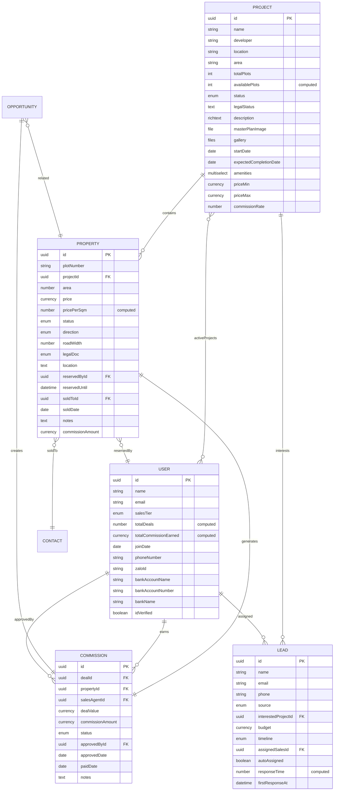

# PRD v1.1: Nền tảng Phân phối Bất động sản

## 📋 Thông tin Tài liệu

- **Phiên bản**: 1.1
- **Ngày tạo**: 06/12/2025
- **Người tạo**: Luis (Dev Team)
- **Trạng thái**: Draft
- **Dự án**: Real Estate Sales Distribution Platform
- **Nền tảng cơ sở**: Twenty CRM (Open-source)

---

## 1. Tổng quan Sản phẩm

### 1.1. Giới thiệu
Nền tảng Phân phối Bất động sản là một hệ thống CRM chuyên biệt được xây dựng trên nền tảng Twenty CRM (open-source), được tùy chỉnh để phục vụ hoạt động kinh doanh bất động sản tại khu vực Long Thành.

### 1.2. Mục tiêu Kinh doanh
- **Quản lý hiệu quả 1000+ sales agents** làm việc bán thời gian
- **Theo dõi real-time** tồn kho bất động sản (land plots) qua nhiều dự án
- **Tự động hóa quy trình** phân phối leads và tính toán hoa hồng
- **Minh bạch hóa** doanh số và thu nhập của từng sales agent
- **Tối ưu hóa** tỷ lệ chuyển đổi leads thành deals

### 1.3. Giá trị Cốt lõi
- **Transparency**: Mọi giao dịch và hoa hồng được theo dõi minh bạch
- **Automation**: Giảm thiểu công việc thủ công qua automation
- **Scalability**: Hỗ trợ mở rộng không giới hạn số lượng sales và projects
- **Performance**: Phản hồi real-time, không lag với 1000+ users đồng thời

---

## 2. Bối cảnh Kinh doanh

### 2.1. Thị trường Mục tiêu
- **Khu vực**: Long Thành, Đồng Nai
- **Sản phẩm**: Đất nền (land plots) trong các dự án phân lô
- **Quy mô**: 1000+ sales agents làm việc bán thời gian
- **Loại hình**: Phân phối qua mạng lưới sales độc lập

### 2.2. Vấn đề Cần Giải quyết
1. **Quản lý tồn kho**: Khó theo dõi real-time lô đất nào available/sold
2. **Phân phối leads**: Thủ công, không công bằng, mất thời gian
3. **Tính hoa hồng**: Dễ nhầm lẫn, chậm thanh toán
4. **Giữ chỗ (Reservation)**: Không có hệ thống tự động release sau 24h
5. **Double-booking**: Nguy cơ nhiều sales book cùng một lô
6. **Theo dõi performance**: Không có dashboard cho sales agents

### 2.3. Giải pháp
Xây dựng nền tảng CRM tích hợp quản lý:
- **Projects** (dự án bất động sản)
- **Properties** (từng lô đất)
- **Sales Performance** (theo dõi hiệu suất)
- **Commission Tracking** (quản lý hoa hồng)
- **Lead Assignment** (phân phối leads tự động)

---

## 3. Người dùng & Personas

### 3.1. Sales Agent (Nhân viên Kinh doanh)
- **Vai trò**: Bán hàng bán thời gian
- **Số lượng**: 1000+ users
- **Nhiệm vụ**:
  - Xem danh sách projects và lô đất available
  - Giữ chỗ (reserve) lô đất cho khách hàng (tối đa 24h)
  - Quản lý leads được giao
  - Theo dõi doanh số và hoa hồng cá nhân
- **Quyền hạn**: Chỉ xem/edit leads của mình, chỉ reserve lô đất

### 3.2. Admin (Quản trị Hệ thống)
- **Vai trò**: Quản lý toàn bộ hệ thống
- **Số lượng**: 5-10 users
- **Nhiệm vụ**:
  - Tạo và quản lý projects
  - Upload sơ đồ mặt bằng, thêm properties
  - Phê duyệt hoa hồng (commission approval)
  - Quản lý danh sách sales agents
  - Xem báo cáo tổng thể
- **Quyền hạn**: Full access tất cả modules

### 3.3. Finance (Kế toán)
- **Vai trò**: Xử lý thanh toán hoa hồng
- **Số lượng**: 2-3 users
- **Nhiệm vụ**:
  - Xem danh sách hoa hồng đã được approve
  - Đánh dấu trạng thái Paid
  - Export CSV để chuyển khoản hàng loạt
- **Quyền hạn**: Chỉ access Commission module

---

## 4. Yêu cầu Chức năng

### 4.1. Module 1: Quản lý Dự án (Projects)

#### 4.1.1. Mô tả
Module quản lý các dự án bất động sản (Real Estate Projects). Mỗi project chứa nhiều lô đất (properties).

#### 4.1.2. Object Data Model

**Custom Object**: `project`

| Field Name | Type | Required | Description |
|------------|------|----------|-------------|
| `name` | TEXT | ✅ | Tên dự án (VD: "Gem Sky World") |
| `developer` | TEXT | | Chủ đầu tư |
| `location` | TEXT | | Địa chỉ chi tiết |
| `area` | SELECT | | Khu vực (Long Thành, Phước Thành...) |
| `totalPlots` | NUMBER | | Tổng số lô trong dự án |
| `availablePlots` | NUMBER | | Số lô còn trống (computed) |
| `status` | SELECT | ✅ | Planning / Active / Sold Out / Suspended |
| `legalStatus` | TEXT | | Tình trạng pháp lý (sổ đỏ, giấy phép) |
| `description` | RICH_TEXT | | Mô tả chi tiết dự án |
| `masterPlanImage` | FILE | | Sơ đồ tổng thể (image/pdf) |
| `gallery` | FILE[] | | Thư viện hình ảnh |
| `startDate` | DATE | | Ngày khởi công |
| `expectedCompletionDate` | DATE | | Ngày dự kiến hoàn thành |
| `amenities` | MULTI_SELECT | | Tiện ích (Công viên, Hồ bơi, Trường học...) |
| `priceMin` | CURRENCY | | Giá thấp nhất (VNĐ) |
| `priceMax` | CURRENCY | | Giá cao nhất (VNĐ) |
| `commissionRate` | NUMBER | | % hoa hồng cho sales (nếu tính theo %) |

**Relations**:
- `properties` (ONE_TO_MANY → Property): Danh sách lô đất trong dự án
- `leads` (ONE_TO_MANY → Lead): Leads quan tâm dự án này

#### 4.1.3. Business Rules
1. **Computed Field**: `availablePlots` = COUNT(properties WHERE status = 'Available')
2. **Auto-update**: Khi property status thay đổi → tự động cập nhật `availablePlots`
3. **Validation**: `priceMax` >= `priceMin`

#### 4.1.4. Views (UI)
- **List View**: Table with filters (area, status, priceRange)
- **Detail View**: Full project information + embedded properties table
- **Map View**: Google Maps showing project locations (Phase 2)
- **Gallery View**: Grid of images

---

### 4.2. Module 2: Quản lý Bất động sản (Properties)

#### 4.2.1. Mô tả
Module quản lý từng lô đất (land plot) trong các dự án. Đây là module quan trọng nhất với business logic phức tạp nhất.

#### 4.2.2. Object Data Model

**Custom Object**: `property`

| Field Name | Type | Required | Description |
|------------|------|----------|-------------|
| `plotNumber` | TEXT | ✅ | Số lô (VD: "A01", "B15") |
| `project` | RELATION | ✅ | Link to Project |
| `area` | NUMBER | ✅ | Diện tích (m²) |
| `price` | CURRENCY | ✅ | Giá bán (VNĐ) |
| `pricePerSqm` | NUMBER | | Giá/m² (computed) |
| `status` | SELECT | ✅ | Available / Reserved / Deposit Paid / Sold |
| `direction` | SELECT | | East / West / South / North / Southeast / ... |
| `roadWidth` | NUMBER | | Chiều rộng mặt đường (m) |
| `legalDoc` | SELECT | | Red Book / Pink Book / Pending / None |
| `location` | TEXT | | Vị trí trong dự án (góc, gần công viên...) |
| `reservedBy` | RELATION | | Link to User (sales đang giữ chỗ) |
| `reservedUntil` | DATETIME | | Thời hạn giữ chỗ (24h sau khi reserve) |
| `soldTo` | RELATION | | Link to Contact (khách hàng mua) |
| `soldDate` | DATE | | Ngày bán |
| `notes` | TEXT | | Ghi chú |
| `commissionAmount` | CURRENCY | | Hoa hồng fixed cho lô này |

**Relations**:
- `project` (MANY_TO_ONE → Project): Thuộc dự án nào
- `reservedBy` (MANY_TO_ONE → User): Sales đang giữ chỗ
- `soldTo` (MANY_TO_ONE → Contact): Khách hàng mua
- `activities` (ONE_TO_MANY → Activity): Lịch sử hoạt động

#### 4.2.3. Business Rules

**1. Status Workflow**:
```
Available → Reserved (sales giữ chỗ) → Deposit Paid (khách đặt cọc) → Sold (hoàn tất)
         ↓ (24h timeout)
      Available (auto-release)
```

**2. Reservation Logic**:
- Sales agent có thể reserve lô status = 'Available'
- Khi reserve: Set `reservedBy` = current user, `reservedUntil` = NOW + 24 hours
- Sau 24h nếu không chuyển sang Deposit Paid → tự động chuyển về 'Available' (background job)

**3. Double-booking Prevention**:
- Database unique constraint hoặc transaction lock
- Chỉ 1 sales có thể reserve 1 lô tại 1 thời điểm
- UI phải disable button nếu lô đang reserved bởi người khác

**4. Computed Fields**:
- `pricePerSqm` = `price` / `area`

**5. Trigger Actions**:
- Khi status thay đổi → Update `project.availablePlots`
- Khi status = 'Sold' → Create Commission record

#### 4.2.4. Background Jobs
**Job: Auto-release Expired Reservations**
- **Frequency**: Mỗi 5 phút (cron: */5 * * * *)
- **Logic**:
  ```sql
  UPDATE properties
  SET status = 'Available',
      reservedBy = NULL,
      reservedUntil = NULL
  WHERE status = 'Reserved'
    AND reservedUntil < NOW()
  ```

#### 4.2.5. Views (UI)
- **List View**: Table với color-coded status
  - Available: Green
  - Reserved: Yellow
  - Deposit Paid: Orange
  - Sold: Gray
- **Detail View**: Full property info + reserve button
- **Grid View**: Compact grid layout
- **Interactive Map View** (Phase 2): SVG overlay trên masterPlanImage

---

### 4.3. Module 3: Quản lý Hiệu suất Sales (Sales Performance)

#### 4.3.1. Mô tả
Mở rộng (extend) Twenty's User object để thêm thông tin và metrics cho sales agents.

#### 4.3.2. User Object Extensions

**Additional Fields for User**:

| Field Name | Type | Description |
|------------|------|-------------|
| `salesTier` | SELECT | Bronze / Silver / Gold / Diamond |
| `totalDeals` | NUMBER | Tổng số deals thành công (computed) |
| `totalCommissionEarned` | CURRENCY | Tổng hoa hồng đã nhận (computed) |
| `joinDate` | DATE | Ngày gia nhập |
| `phoneNumber` | PHONE | Số điện thoại |
| `zaloId` | TEXT | Zalo ID để liên lạc |
| `bankAccountName` | TEXT | Tên tài khoản ngân hàng |
| `bankAccountNumber` | TEXT | Số tài khoản |
| `bankName` | TEXT | Tên ngân hàng |
| `idVerified` | BOOLEAN | Đã xác minh CCCD/CMND chưa |

**Relations**:
- `activeProjects` (MANY_TO_MANY → Project): Các dự án được phép bán
- `reservedProperties` (ONE_TO_MANY → Property): Các lô đang giữ chỗ
- `commissions` (ONE_TO_MANY → Commission): Danh sách hoa hồng

#### 4.3.3. Computed Fields Logic

**totalDeals**:
```sql
SELECT COUNT(*)
FROM opportunities
WHERE assignedTo = user.id
  AND status = 'Won'
```

**totalCommissionEarned**:
```sql
SELECT SUM(commissionAmount)
FROM commissions
WHERE salesAgent = user.id
  AND status = 'Paid'
```

#### 4.3.4. Dashboard Widgets

**Widget 1: My Performance (Hiệu suất của tôi)**
- Deals tháng này: X deals
- Hoa hồng tháng này: XXX,XXX VNĐ
- Hoa hồng chờ duyệt: XXX,XXX VNĐ
- Tỷ lệ chuyển đổi: XX%

**Widget 2: Leaderboard (Bảng xếp hạng)**
- Top 10 sales agents tháng này (theo revenue)
- Hiển thị: Rank, Name, Deals, Commission

**Widget 3: Available Plots (Lô đất có sẵn)**
- Quick view các lô Available theo project
- Click to reserve

**Widget 4: My Reserved Plots (Lô tôi đang giữ)**
- Danh sách lô đang reserve
- Countdown timer cho từng lô (còn X giờ Y phút)
- Button "Convert to Deposit" / "Release"

---

### 4.4. Module 4: Quản lý Hoa hồng (Commission Tracking)

#### 4.4.1. Mô tả
Theo dõi và quản lý hoa hồng cho sales agents. Hệ thống tự động tạo commission record khi deal thành công.

#### 4.4.2. Object Data Model

**Custom Object**: `commission`

| Field Name | Type | Required | Description |
|------------|------|----------|-------------|
| `deal` | RELATION | ✅ | Link to Opportunity/Deal |
| `property` | RELATION | ✅ | Link to Property |
| `salesAgent` | RELATION | ✅ | Link to User (sales) |
| `dealValue` | CURRENCY | ✅ | Giá trị giao dịch (property.price) |
| `commissionAmount` | CURRENCY | ✅ | Số tiền hoa hồng |
| `status` | SELECT | ✅ | Pending / Approved / Paid / Rejected |
| `approvedBy` | RELATION | | Link to User (admin phê duyệt) |
| `approvedDate` | DATE | | Ngày phê duyệt |
| `paidDate` | DATE | | Ngày thanh toán |
| `notes` | TEXT | | Ghi chú |

**Relations**:
- `deal` (MANY_TO_ONE → Opportunity)
- `property` (MANY_TO_ONE → Property)
- `salesAgent` (MANY_TO_ONE → User)
- `approvedBy` (MANY_TO_ONE → User)

#### 4.4.3. Business Rules

**Auto-creation Trigger**:
- **Event**: Opportunity status changes to 'Won'
- **Action**:
  ```javascript
  CREATE Commission {
    deal: opportunity,
    property: opportunity.relatedProperty,
    salesAgent: opportunity.assignedTo,
    dealValue: property.price,
    commissionAmount: calculateCommission(property),
    status: 'Pending'
  }
  ```

**Commission Calculation**:
```javascript
function calculateCommission(property) {
  if (property.commissionAmount) {
    return property.commissionAmount; // Fixed amount
  } else if (property.project.commissionRate) {
    return property.price * property.project.commissionRate / 100; // Percentage
  } else {
    return 0; // Default if not set
  }
}
```

**Status Workflow**:
```
Pending → (Admin Review) → Approved → (Finance Payment) → Paid
        ↓
      Rejected (with reason)
```

#### 4.4.4. Admin Features

**Approval Queue (Hàng chờ phê duyệt)**:
- List view: All commissions với status = 'Pending'
- Bulk approval: Select multiple → Approve all
- Single approval: View detail → Approve/Reject

**Payment Batch Export**:
- Filter: Status = 'Approved'
- Export CSV columns:
  - Sales Agent Name
  - Bank Name
  - Account Number
  - Amount
  - Property (reference)
- Admin downloads → Upload to bank for batch transfer

#### 4.4.5. Reports
- **Commission Summary by Agent**: Tổng hoa hồng theo từng sales
- **Commission Summary by Month**: Tổng chi phí hoa hồng theo tháng
- **Pending Approvals**: Số lượng commissions chờ duyệt
- **Paid vs Pending**: So sánh đã thanh toán vs chưa thanh toán

---

### 4.5. Module 5: Phân phối Leads Tự động (Lead Assignment)

#### 4.5.1. Mô tả
Hệ thống tự động phân phối leads cho sales agents theo thuật toán công bằng và thông minh.

#### 4.5.2. Lead Object Extensions

**Additional Fields for Lead** (Twenty's standard Lead object):

| Field Name | Type | Description |
|------------|------|-------------|
| `source` | SELECT | Website / Facebook / Zalo / Referral / Walk-in |
| `interestedProject` | RELATION | Link to Project (dự án quan tâm) |
| `budget` | CURRENCY | Ngân sách khách hàng |
| `timeline` | SELECT | Immediate / 1-3 months / 3-6 months / 6+ months |
| `assignedSales` | RELATION | Link to User (sales được giao) |
| `autoAssigned` | BOOLEAN | Tự động assign hay manual |
| `responseTime` | NUMBER | Thời gian phản hồi (minutes - computed) |
| `firstResponseAt` | DATETIME | Thời điểm sales phản hồi lần đầu |

#### 4.5.3. Auto-Assignment Algorithm

**Trigger**: New lead created (status = 'New')

**Algorithm**:
```javascript
function assignLead(lead) {
  // 1. Get eligible sales agents
  let eligibleSales = User.where('role = sales AND isActive = true');

  // 2. Filter by activeProjects (nếu lead có interestedProject)
  if (lead.interestedProject) {
    eligibleSales = eligibleSales.filter(s =>
      s.activeProjects.includes(lead.interestedProject)
    );
  }

  // 3. Remove overloaded agents (>10 open leads)
  eligibleSales = eligibleSales.filter(s =>
    s.openLeadsCount < 10
  );

  // 4. Round-robin assignment
  const nextAgent = getNextInRotation(eligibleSales);

  // 5. Assign
  lead.assignedSales = nextAgent;
  lead.autoAssigned = true;
  lead.save();

  // 6. Send notification
  sendNotification(nextAgent, lead);
}
```

**Round-robin Implementation**:
- Maintain counter in Redis: `lead_assignment_counter`
- Increment counter
- Assign to: `eligibleSales[counter % eligibleSales.length]`

#### 4.5.4. SLA Tracking

**Response SLA**: 30 minutes

**Tracking Logic**:
```javascript
responseTime = firstResponseAt - createdAt (in minutes)

if (responseTime > 30) {
  // Alert admin
  sendAlert('Sales agent {name} exceeded SLA for lead {id}');

  // Optional: Auto-reassign after 1 hour
  if (responseTime > 60 && noActivity) {
    reassignLead(lead);
  }
}
```

**Computed Field**: `responseTime`
```sql
EXTRACT(EPOCH FROM (firstResponseAt - createdAt)) / 60
```

#### 4.5.5. Manual Assignment Override
- Admin có thể manual assign lead cho specific sales
- Set `autoAssigned = false`
- Ghi log lý do manual assignment

#### 4.5.6. Notifications
**Khi lead được assign**:
- **Channel**: Email + Zalo (nếu có Zalo integration)
- **Content**:
  - Lead name, phone, email
  - Interested project
  - Budget
  - Timeline
  - Link to lead detail page

---

## 5. Yêu cầu Phi chức năng

### 5.1. Performance
- **Response time**: < 200ms cho API calls
- **Page load**: < 2s cho dashboard
- **Concurrent users**: Hỗ trợ 1000+ users đồng thời
- **Database**: Optimize indexes cho queries thường dùng

### 5.2. Scalability
- **Horizontal scaling**: Có thể thêm server nodes khi traffic tăng
- **Database**: PostgreSQL với replication
- **Queue**: BullMQ với Redis cluster
- **CDN**: Static assets serve từ CDN

### 5.3. Security
- **Authentication**: JWT tokens với refresh mechanism
- **Authorization**: Role-based access control (RBAC)
  - Sales: Chỉ xem/edit data của mình
  - Admin: Full access
  - Finance: Access Commission module only
- **Data encryption**: Sensitive data (bank info) encrypted at rest
- **Audit log**: Log tất cả actions quan trọng (assign lead, approve commission, etc.)

### 5.4. Availability
- **Uptime**: 99.5% (tối thiểu)
- **Backup**: Daily database backup, retain 30 days
- **Disaster recovery**: Khôi phục trong vòng 4 hours

### 5.5. Usability
- **Responsive**: Mobile-friendly UI (sales agents dùng phone nhiều)
- **Language**: Vietnamese interface
- **Accessibility**: WCAG 2.1 Level AA compliance

---

## 6. Kiến trúc Hệ thống

### 6.1. Tech Stack

**Backend**:
- **Framework**: NestJS (TypeScript)
- **Database**: PostgreSQL 16
- **Cache**: Redis
- **Queue**: BullMQ
- **ORM**: TypeORM (via Twenty's metadata system)
- **GraphQL**: Apollo Server (via Twenty)

**Frontend**:
- **Framework**: React 18 + TypeScript
- **State Management**: Recoil (Twenty's choice)
- **UI Components**: Twenty UI components + custom components
- **Styling**: Emotion CSS-in-JS
- **GraphQL Client**: Apollo Client

**Infrastructure**:
- **Deployment**: Docker + Docker Compose
- **Platform**: Dokploy (self-hosted PaaS)
- **Web Server**: Nginx (reverse proxy)
- **SSL**: Let's Encrypt
- **Monitoring**: (TBD - Sentry for errors, custom metrics)

### 6.2. Architecture Diagram

```
┌─────────────────────────────────────────────────────────────┐
│                        FRONTEND (React)                      │
│  ┌─────────────┐  ┌──────────────┐  ┌──────────────────┐  │
│  │  Dashboard  │  │ Projects UI  │  │  Properties UI   │  │
│  └─────────────┘  └──────────────┘  └──────────────────┘  │
│  ┌─────────────┐  ┌──────────────┐  ┌──────────────────┐  │
│  │ Commission  │  │   Leads UI   │  │   Reports UI     │  │
│  │   Approval  │  │              │  │                  │  │
│  └─────────────┘  └──────────────┘  └──────────────────┘  │
└────────────────────────┬────────────────────────────────────┘
                         │ GraphQL (Apollo Client)
                         ▼
┌─────────────────────────────────────────────────────────────┐
│               BACKEND (NestJS + Twenty CRM)                 │
│  ┌──────────────────────────────────────────────────────┐  │
│  │         GraphQL API (Auto-generated)                 │  │
│  └──────────────────────────────────────────────────────┘  │
│  ┌──────────────┐  ┌──────────────┐  ┌───────────────┐   │
│  │   Project    │  │   Property   │  │  Commission   │   │
│  │   Service    │  │   Service    │  │   Service     │   │
│  └──────────────┘  └──────────────┘  └───────────────┘   │
│  ┌──────────────┐  ┌──────────────┐  ┌───────────────┐   │
│  │     Lead     │  │  Background  │  │  Notification │   │
│  │  Assignment  │  │     Jobs     │  │   Service     │   │
│  │   Service    │  │  (BullMQ)    │  │               │   │
│  └──────────────┘  └──────────────┘  └───────────────┘   │
└────────────────────────┬────────────────────────────────────┘
                         │
         ┌───────────────┼───────────────┐
         ▼               ▼               ▼
  ┌──────────┐    ┌───────────┐   ┌──────────┐
  │PostgreSQL│    │   Redis   │   │  Queue   │
  │    DB    │    │  (Cache)  │   │(BullMQ)  │
  └──────────┘    └───────────┘   └──────────┘
```

### 6.3. Data Flow Examples

**Example 1: Sales Agent Reserves a Property**
```
1. User clicks "Reserve" button on Property detail page
2. Frontend sends GraphQL mutation: `reserveProperty(id, userId)`
3. Backend validation:
   - Check property.status == 'Available'
   - Check no other active reservation
4. Update property:
   - status = 'Reserved'
   - reservedBy = userId
   - reservedUntil = NOW + 24h
5. Update project.availablePlots (decrement)
6. Return success → Frontend shows "Reserved successfully"
7. Background job monitors reservedUntil
```

**Example 2: Auto-assign New Lead**
```
1. New lead created (from web form submission)
2. Webhook/Event fired: "Lead.Created"
3. LeadAssignmentService.assignLead(lead)
   - Get eligible sales (activeProjects, openLeadsCount < 10)
   - Round-robin selection
   - Update lead.assignedSales
4. Send notification (Email + Zalo)
5. Sales receives alert on phone
```

---

## 7. Data Model (ERD)



---

## 8. User Stories

### 8.1. Epic 1: Project Management

**US-1.1**: Tạo dự án mới
```
AS AN Admin
I WANT TO create a new real estate project
SO THAT I can start managing properties in that project

Acceptance Criteria:
- Can input all project fields (name, developer, location, etc.)
- Can upload master plan image
- Can upload gallery images (multiple)
- Can set price range (min/max)
- System validates required fields
- Upon creation, project appears in projects list
```

**US-1.2**: Xem danh sách dự án
```
AS A Sales Agent
I WANT TO view list of all active projects
SO THAT I can see available projects to sell

Acceptance Criteria:
- List shows: Project name, location, available plots, status
- Can filter by area (Long Thành, Phước Thành, etc.)
- Can filter by status (Active, Planning, etc.)
- Can search by project name
- Can sort by various fields
```

### 8.2. Epic 2: Property Management

**US-2.1**: Giữ chỗ (Reserve) lô đất
```
AS A Sales Agent
I WANT TO reserve a property for my customer
SO THAT no other agent can sell it while I'm processing

Acceptance Criteria:
- Can only reserve if property status = 'Available'
- Reservation expires after 24 hours automatically
- System shows countdown timer
- Cannot reserve if property already reserved by someone else
- Property shows as "Reserved by me" in my view
```

**US-2.2**: Xem lô đất available
```
AS A Sales Agent
I WANT TO view all available properties in a project
SO THAT I can show options to my customers

Acceptance Criteria:
- List shows only Available properties
- Can filter by price range, area size, direction
- Properties color-coded by status
- Shows key info: plot number, area, price, price/sqm
- Click to view details
```

**US-2.3**: Auto-release expired reservations
```
AS A System
I WANT TO automatically release properties after 24 hours
SO THAT inventory doesn't get locked unnecessarily

Acceptance Criteria:
- Background job runs every 5 minutes
- Checks all Reserved properties with reservedUntil < NOW
- Sets status back to 'Available'
- Clears reservedBy and reservedUntil fields
- Sends notification to sales agent (reservation expired)
```

### 8.3. Epic 3: Commission Management

**US-3.1**: Tự động tạo hoa hồng khi deal thành công
```
AS A System
I WANT TO automatically create a commission record when deal closes
SO THAT sales agents don't miss their earnings

Acceptance Criteria:
- Triggered when Opportunity status = 'Won'
- Commission amount calculated from property settings
- Commission status = 'Pending'
- Sales agent can see it in "Pending Commissions" list
```

**US-3.2**: Admin phê duyệt hoa hồng
```
AS AN Admin
I WANT TO review and approve commissions
SO THAT we ensure accuracy before payment

Acceptance Criteria:
- View list of Pending commissions
- Can bulk approve multiple commissions
- Can reject with reason (notes field)
- Approved commissions move to Finance queue
- Sales agent receives notification
```

**US-3.3**: Finance xuất CSV thanh toán
```
AS A Finance User
I WANT TO export approved commissions to CSV
SO THAT I can batch transfer via bank

Acceptance Criteria:
- Filter commissions by status = 'Approved'
- Export includes: Sales name, bank info, amount, property reference
- Can mark as 'Paid' after transfer
- Paid date auto-filled
```

### 8.4. Epic 4: Lead Assignment

**US-4.1**: Tự động phân phối leads
```
AS A System
I WANT TO automatically assign new leads to sales agents
SO THAT distribution is fair and fast

Acceptance Criteria:
- New leads auto-assigned within 1 minute
- Assignment follows round-robin among eligible agents
- Agents with >10 open leads skipped
- Priority given to agents with matching activeProjects
- Agent receives notification immediately
```

**US-4.2**: Tracking response SLA
```
AS AN Admin
I WANT TO track how quickly sales respond to leads
SO THAT I can identify performance issues

Acceptance Criteria:
- System tracks firstResponseAt timestamp
- Calculates responseTime in minutes
- Alert if >30 minutes with no response
- Dashboard shows average response time per agent
```

### 8.5. Epic 5: Sales Dashboard

**US-5.1**: Xem dashboard cá nhân
```
AS A Sales Agent
I WANT TO view my performance dashboard
SO THAT I can track my progress and earnings

Acceptance Criteria:
- Shows: Deals this month, commission this month, pending commission
- Shows: My reserved properties with countdown timers
- Shows: Available plots quick view
- Shows: My rank in leaderboard
- Refreshes real-time (or every 30 seconds)
```

---

## 9. UI/UX Requirements

### 9.1. Design Principles
- **Mobile-first**: Sales agents primarily use phones
- **Minimal clicks**: Key actions accessible in 1-2 clicks
- **Clear status indicators**: Color-coded statuses visible at a glance
- **Real-time updates**: Use WebSocket for live notifications

### 9.2. Key Screens

**1. Dashboard (Sales Agent View)**
```
┌─────────────────────────────────────────────┐
│  My Performance                              │
│  Deals: 5 | Commission: 50M VNĐ | Rank: #8  │
└─────────────────────────────────────────────┘

┌──────────────────────────────────────────┐
│  My Reserved Properties      [2]          │
│  - Lô A05 (Gem Sky) [⏱️ 3h 45m left]     │
│  - Lô B12 (Long Thành Center) [⏱️ 21h]   │
└──────────────────────────────────────────┘

┌──────────────────────────────────────────┐
│  Quick Actions                            │
│  [Browse Projects] [My Leads] [Reports]   │
└──────────────────────────────────────────┘
```

**2. Property List View**
```
┌──────────────────────────────────────────────┐
│  Properties - Gem Sky World Project          │
│  Filters: [Status] [Price] [Area] [Direction]│
├──────────────────────────────────────────────┤
│  🟢 A01 | 120m² | 3.6M | 30M/m² | [Reserve]  │
│  🟡 A02 | 150m² | 4.5M | 30M/m² | Reserved   │
│  🟢 A03 | 100m² | 3.0M | 30M/m² | [Reserve]  │
│  🔴 A04 | 180m² | 5.4M | 30M/m² | Sold       │
└──────────────────────────────────────────────┘
```

**3. Commission Approval Queue (Admin)**
```
┌─────────────────────────────────────────────┐
│  Pending Commissions                [15]     │
│  [Select All] [Approve Selected] [Reject]   │
├─────────────────────────────────────────────┤
│  ☐ Nguyen Van A | Lô A05 | 2M VNĐ | Details │
│  ☐ Tran Thi B   | Lô B12 | 1.5M  | Details │
│  ☐ Le Van C     | Lô C20 | 3M    | Details │
└─────────────────────────────────────────────┘
```

### 9.3. Responsive Breakpoints
- **Mobile**: < 768px (primary target)
- **Tablet**: 768px - 1024px
- **Desktop**: > 1024px

### 9.4. Accessibility
- **Keyboard navigation**: All functions accessible via keyboard
- **Screen reader**: ARIA labels for all interactive elements
- **Color contrast**: WCAG AA compliant (4.5:1 ratio)
- **Touch targets**: Minimum 44x44px for mobile

---

## 10. Integration & API

### 10.1. External Integrations (Future)
- **Zalo OA**: Send notifications to sales agents
- **Banking API**: Auto-verify bank transfers (optional)
- **Google Maps**: Project location display
- **SMS Gateway**: Backup notification channel

### 10.2. GraphQL API Structure

**Queries**:
```graphql
# Projects
projects(filter: ProjectFilterInput, sort: ProjectSortInput): [Project!]!
project(id: ID!): Project

# Properties
properties(projectId: ID, status: PropertyStatus): [Property!]!
property(id: ID!): Property
myReservedProperties: [Property!]!

# Commissions
commissions(status: CommissionStatus): [Commission!]!
myCommissions: [Commission!]!
pendingCommissionsCount: Int!

# Leads
leads(assignedToMe: Boolean): [Lead!]!
lead(id: ID!): Lead

# User
me: User!
myPerformance: PerformanceMetrics!
leaderboard(period: PeriodEnum!): [LeaderboardEntry!]!
```

**Mutations**:
```graphql
# Projects
createProject(input: CreateProjectInput!): Project!
updateProject(id: ID!, input: UpdateProjectInput!): Project!

# Properties
createProperty(input: CreatePropertyInput!): Property!
reserveProperty(id: ID!): Property!
releaseProperty(id: ID!): Property!
convertToDeposit(id: ID!, contactId: ID!): Property!
markAsSold(id: ID!): Property!

# Commissions
approveCommission(id: ID!): Commission!
rejectCommission(id: ID!, reason: String!): Commission!
markAsPaid(ids: [ID!]!): [Commission!]!

# Leads
createLead(input: CreateLeadInput!): Lead!
reassignLead(id: ID!, newAgentId: ID!): Lead!
markLeadResponded(id: ID!): Lead!
```

**Subscriptions** (Real-time):
```graphql
propertyStatusChanged(projectId: ID): Property!
newLeadAssigned: Lead!
commissionApproved: Commission!
reservationExpiringSoon: Property!
```

---

## 11. Security & Permissions

### 11.1. Role-based Access Control (RBAC)

| Resource | Sales Agent | Admin | Finance |
|----------|-------------|-------|---------|
| Projects | Read | Full | Read |
| Properties | Read + Reserve own | Full | Read |
| Commissions (Own) | Read | Read | Read |
| Commissions (All) | - | Read + Approve | Read + Mark Paid |
| Leads (Assigned) | Full | Full | - |
| Leads (All) | - | Full | - |
| Users | Read basic | Full | Read basic |
| Reports | Own only | All | Financial only |

### 11.2. Data Privacy
- **PII Protection**: Bank account numbers encrypted at rest
- **Audit Log**: Log all sensitive operations (approve commission, assign lead, etc.)
- **Data Retention**: Keep deleted records for 90 days (soft delete)

### 11.3. API Security
- **Authentication**: JWT with 15min expiry, refresh token 30 days
- **Rate Limiting**: 100 requests/minute per user
- **Input Validation**: Validate all inputs server-side
- **SQL Injection**: Use parameterized queries (TypeORM)
- **XSS Protection**: Sanitize all user inputs

---

## 12. Testing Strategy

### 12.1. Unit Tests
- **Coverage target**: 80% for business logic
- **Framework**: Jest
- **Focus areas**:
  - Commission calculation logic
  - Lead assignment algorithm
  - Reservation expiry logic

### 12.2. Integration Tests
- **Framework**: Jest + Supertest
- **Test scenarios**:
  - Full reservation workflow
  - Commission creation on deal won
  - Auto-assignment of leads

### 12.3. E2E Tests
- **Framework**: Playwright
- **Critical paths**:
  - Sales agent reserves property → converts to deposit → closes deal → commission created
  - Admin creates project → adds properties → sales reserves → admin approves commission
  - New lead created → auto-assigned → sales responds

### 12.4. Performance Tests
- **Tool**: k6 or Artillery
- **Scenarios**:
  - 1000 concurrent users browsing properties
  - 100 concurrent property reservations
  - Lead assignment under load

---

## 13. Deployment & DevOps

### 13.1. Deployment Strategy
- **Platform**: Dokploy (self-hosted)
- **Environment**: Docker containers
- **Process**:
  1. Build Docker image
  2. Push to registry
  3. Deploy via Dokploy
  4. Run database migrations
  5. Health check
  6. Switch traffic (zero-downtime)

### 13.2. CI/CD Pipeline
```yaml
stages:
  - lint
  - test
  - build
  - deploy

lint:
  - ESLint (frontend + backend)
  - Prettier check

test:
  - Unit tests
  - Integration tests
  - E2E tests (on staging)

build:
  - Build frontend (vite)
  - Build backend (nest build)
  - Build Docker image

deploy:
  - Deploy to staging (auto)
  - Deploy to production (manual approval)
```

### 13.3. Environments
- **Development**: Local Docker Compose
- **Staging**: Dokploy instance (pre-production testing)
- **Production**: Dokploy instance (live)

### 13.4. Monitoring
- **Error Tracking**: Sentry
- **Logs**: Centralized logging (ELK stack or similar)
- **Metrics**: Custom Prometheus metrics
  - Property reservation rate
  - Lead response time
  - Commission approval time
  - API response times

### 13.5. Backup & Disaster Recovery
- **Database Backup**: Daily automated backup to S3-compatible storage
- **Retention**: 30 days
- **Recovery Time Objective (RTO)**: 4 hours
- **Recovery Point Objective (RPO)**: 24 hours

---

## 14. Success Metrics & KPIs

### 14.1. Business Metrics
- **Total Sales Volume**: Revenue from sold properties
- **Conversion Rate**: Leads → Deals (target: >20%)
- **Average Deal Cycle**: Days from lead to close (target: <30 days)
- **Sales Agent Satisfaction**: Survey score (target: >4/5)

### 14.2. Operational Metrics
- **Lead Response Time**: Average time to first response (target: <15 min)
- **Property Turnover**: Days from Available to Sold (target: <60 days)
- **Reservation Conversion**: Reserved → Deposit Paid (target: >60%)
- **Commission Processing Time**: Pending → Paid (target: <7 days)

### 14.3. Technical Metrics
- **System Uptime**: % availability (target: >99.5%)
- **API Response Time**: P95 latency (target: <200ms)
- **Error Rate**: % failed requests (target: <0.1%)
- **Active Users**: Daily/Monthly active users

---

## 15. Rủi ro & Giả định

### 15.1. Assumptions (Giả định)

**[ASSUMPTION 1]**: Commission rates are either:
- Fixed amount per property (stored in `property.commissionAmount`)
- OR percentage of deal value (stored in `project.commissionRate`)

**[ASSUMPTION 2]**: This is a new system with no legacy data to migrate

**[ASSUMPTION 3]**: Sales agents have smartphones with internet access

**[ASSUMPTION 4]**: Admin will manually define plot polygons for interactive map (Phase 2)

**[ASSUMPTION 5]**: Initial scale: 1000 agents, 50 projects, 5000 properties

### 15.2. Risks (Rủi ro)

| Risk | Severity | Mitigation |
|------|----------|------------|
| **Double-booking** properties | High | Database-level locking + transaction isolation |
| **Performance** degradation with 1000+ users | Medium | Caching, indexes, load testing before launch |
| **Twenty CRM limitations** for custom objects | High | Phase 1: Research Twenty's capabilities thoroughly |
| **Sales agent** adoption resistance | Medium | Training sessions + simple UX |
| **Commission disputes** | Medium | Clear audit trail + approval workflow |
| **Data loss** | High | Daily backups + test recovery process |

### 15.3. Constraints (Ràng buộc)
- **Budget**: Self-hosted solution (Dokploy), minimize cloud costs
- **Timeline**: 4-6 weeks for MVP (5 core modules)
- **Team**: Solo developer (initially)
- **Technology**: Must build on Twenty CRM (cannot use alternative CRM)

---

## 16. Roadmap & Phasing

### 16.1. MVP (Phase 1) - 4 weeks
**Goal**: Core functionality for managing properties and commissions

**Modules**:
- ✅ Projects (basic CRUD)
- ✅ Properties (CRUD + reservation + auto-release)
- ✅ User extensions (sales fields)
- ✅ Commission tracking (auto-creation + approval)
- ✅ Basic dashboard

**Features NOT included in MVP**:
- Lead auto-assignment (manual assignment only)
- Interactive map view
- Advanced reports
- Notifications (email/Zalo)

### 16.2. Phase 2 - 2 weeks
**Focus**: Lead management + notifications

**Additions**:
- ✅ Lead auto-assignment with round-robin
- ✅ SLA tracking
- ✅ Email notifications
- ✅ Zalo integration (if API available)

### 16.3. Phase 3 - 2 weeks
**Focus**: Enhanced UX + reporting

**Additions**:
- ✅ Interactive SVG plot map
- ✅ Google Maps integration for project locations
- ✅ Advanced reports and analytics
- ✅ Export functions (PDF reports, CSV exports)

### 16.4. Future Enhancements
- **Mobile App**: Native iOS/Android app
- **AI Features**: Lead scoring, price recommendations
- **Integration**: Accounting software integration
- **Marketing**: Landing page builder for projects

---

## 17. Acceptance Criteria (cho PRD này)

This PRD is considered complete and approved when:

- [x] All 5 core modules documented with data models
- [x] Business rules clearly defined
- [x] User stories written for each epic
- [x] Technical architecture specified
- [x] Security requirements defined
- [x] Success metrics established
- [x] Risks and assumptions documented
- [ ] **Reviewed and approved by stakeholders**

---

## 18. Appendix

### A. Glossary

| Term | Definition |
|------|------------|
| **Land Plot** | Lô đất trong dự án phân lô |
| **Reservation** | Giữ chỗ tạm thời (24h) trước khi đặt cọc |
| **Deposit Paid** | Khách hàng đã đặt cọc (serious buyer) |
| **Commission** | Hoa hồng cho sales agent |
| **SLA** | Service Level Agreement (thời gian phản hồi cam kết) |
| **Round-robin** | Thuật toán phân phối công bằng theo vòng tròn |
| **RBAC** | Role-Based Access Control (phân quyền theo vai trò) |

### B. References

1. **Twenty CRM Documentation**: https://docs.twenty.com
2. **Twenty GitHub**: https://github.com/twentyhq/twenty
3. **NestJS Documentation**: https://docs.nestjs.com
4. **GraphQL Best Practices**: https://graphql.org/learn/best-practices/
5. **PostgreSQL Documentation**: https://www.postgresql.org/docs/

### C. Document History

| Version | Date | Author | Changes |
|---------|------|--------|---------|
| 1.0 | 06/12/2025 | Luis | Initial draft |
| 1.1 | 06/12/2025 | Luis | Added data models, user stories, architecture diagrams |

---

## 19. Sign-off

**Product Owner**: ___________________ Date: ___________

**Tech Lead**: ___________________ Date: ___________

**Stakeholder**: ___________________ Date: ___________

---

**END OF DOCUMENT**

*Tài liệu này là tài liệu sống (living document) và sẽ được cập nhật khi có thay đổi yêu cầu hoặc phát hiện mới trong quá trình phát triển.*
