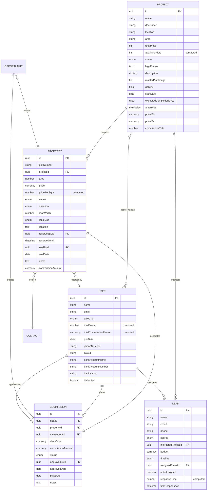

# PRD v1.2: Nền tảng Phân phối Bất động sản

## 📋 Thông tin Tài liệu

- **Phiên bản**: 1.2
- **Ngày tạo**: 06/12/2025
- **Ngày cập nhật**: 06/12/2025
- **Người tạo**: Luis (Dev Team)
- **Người phân tích**: Mary (Business Analyst)
- **Trạng thái**: Ready for Review
- **Dự án**: Real Estate Sales Distribution Platform
- **Nền tảng cơ sở**: Twenty CRM (Open-source)

### Changelog v1.2

**Improvements from v1.1**:
- ✅ Added Module 2.5: Contact/Customer Management
- ✅ Added Module 2.6: Deal/Transaction Management
- ✅ Added Customer Persona (Section 3.4)
- ✅ Expanded Non-functional Requirements with specific metrics
- ✅ Added File Storage Strategy (Section 6.5)
- ✅ Added Change Management Plan (Section 11.5)
- ✅ Added Training Plan (Section 11.6)
- ✅ Added Phase 0: Technical Validation (before Phase 1)
- ✅ Added Maintenance & Support Plan (Section 17)
- ✅ Added Legal & Compliance (Section 18)
- ✅ Added Cost-Benefit Analysis (Section 19)
- ✅ Fixed inconsistencies in field naming and status enums
- ✅ Added detailed acceptance criteria to user stories
- ✅ Addressed all critical issues from PRD Analysis Report v1.0

---

## 1. Tổng quan Sản phẩm

### 1.1. Giới thiệu
Nền tảng Phân phối Bất động sản là một hệ thống CRM chuyên biệt được xây dựng trên nền tảng Twenty CRM (open-source), được tùy chỉnh để phục vụ hoạt động kinh doanh bất động sản tại khu vực Long Thành.

### 1.2. Mục tiêu Kinh doanh
- **Quản lý hiệu quả 1000+ sales agents** làm việc bán thời gian
- **Theo dõi real-time** tồn kho bất động sản (land plots) qua nhiều dự án
- **Tự động hóa quy trình** phân phối leads và tính toán hoa hồng
- **Minh bạch hóa** doanh số và thu nhập của từng sales agent
- **Tối ưu hóa** tỷ lệ chuyển đổi leads thành deals

### 1.3. Giá trị Cốt lõi
- **Transparency**: Mọi giao dịch và hoa hồng được theo dõi minh bạch
- **Automation**: Giảm thiểu công việc thủ công qua automation
- **Scalability**: Hỗ trợ mở rộng không giới hạn số lượng sales và projects
- **Performance**: Phản hồi real-time, không lag với 1000+ users đồng thời

---

## 2. Bối cảnh Kinh doanh

### 2.1. Thị trường Mục tiêu
- **Khu vực**: Long Thành, Đồng Nai
- **Sản phẩm**: Đất nền (land plots) trong các dự án phân lô
- **Quy mô**: 1000+ sales agents làm việc bán thời gian
- **Loại hình**: Phân phối qua mạng lưới sales độc lập

### 2.2. Vấn đề Cần Giải quyết
1. **Quản lý tồn kho**: Khó theo dõi real-time lô đất nào available/sold
2. **Phân phối leads**: Thủ công, không công bằng, mất thời gian
3. **Tính hoa hồng**: Dễ nhầm lẫn, chậm thanh toán
4. **Giữ chỗ (Reservation)**: Không có hệ thống tự động release sau 24h
5. **Double-booking**: Nguy cơ nhiều sales book cùng một lô
6. **Theo dõi performance**: Không có dashboard cho sales agents

### 2.3. Giải pháp
Xây dựng nền tảng CRM tích hợp quản lý:
- **Projects** (dự án bất động sản)
- **Properties** (từng lô đất)
- **Sales Performance** (theo dõi hiệu suất)
- **Commission Tracking** (quản lý hoa hồng)
- **Lead Assignment** (phân phối leads tự động)

---

## 3. Người dùng & Personas

### 3.1. Sales Agent (Nhân viên Kinh doanh)
- **Vai trò**: Bán hàng bán thời gian
- **Số lượng**: 1000+ users
- **Nhiệm vụ**:
  - Xem danh sách projects và lô đất available
  - Giữ chỗ (reserve) lô đất cho khách hàng (tối đa 24h)
  - Quản lý leads được giao
  - Theo dõi doanh số và hoa hồng cá nhân
- **Quyền hạn**: Chỉ xem/edit leads của mình, chỉ reserve lô đất

### 3.2. Admin (Quản trị Hệ thống)
- **Vai trò**: Quản lý toàn bộ hệ thống
- **Số lượng**: 5-10 users
- **Nhiệm vụ**:
  - Tạo và quản lý projects
  - Upload sơ đồ mặt bằng, thêm properties
  - Phê duyệt hoa hồng (commission approval)
  - Quản lý danh sách sales agents
  - Xem báo cáo tổng thể
- **Quyền hạn**: Full access tất cả modules

### 3.3. Finance (Kế toán)
- **Vai trò**: Xử lý thanh toán hoa hồng
- **Số lượng**: 2-3 users
- **Nhiệm vụ**:
  - Xem danh sách hoa hồng đã được approve
  - Đánh dấu trạng thái Paid
  - Export CSV để chuyển khoản hàng loạt
- **Quyền hạn**: Chỉ access Commission module

### 3.4. Customer/Buyer (Khách hàng Mua)
- **Vai trò**: Khách hàng mua bất động sản
- **Số lượng**: Unlimited (external users)
- **Tương tác**:
  - Được sales agent tạo Contact record trong hệ thống
  - KHÔNG có quyền truy cập trực tiếp vào hệ thống (Phase 1)
  - Thông tin được quản lý bởi sales agent
  - Nhận thông báo qua email/SMS từ sales agent (outside system)
- **Thông tin lưu trữ**: Name, phone, email, ID number, address, budget, timeline
- **Quyền hạn**: None (data subject only)

**Note**: Trong Phase 1 (MVP), customers KHÔNG có portal. Tất cả interaction qua sales agents. Customer portal có thể được thêm vào Phase 3 nếu cần.

---

## 4. Yêu cầu Chức năng

### 4.1. Module 1: Quản lý Dự án (Projects)

#### 4.1.1. Mô tả
Module quản lý các dự án bất động sản (Real Estate Projects). Mỗi project chứa nhiều lô đất (properties).

#### 4.1.2. Object Data Model

**Custom Object**: `project`

| Field Name | Type | Required | Description |
|------------|------|----------|-------------|
| `name` | TEXT | ✅ | Tên dự án (VD: "Gem Sky World") |
| `developer` | TEXT | | Chủ đầu tư |
| `location` | TEXT | | Địa chỉ chi tiết |
| `area` | SELECT | | Khu vực (Long Thành, Phước Thành...) |
| `totalPlots` | NUMBER | | Tổng số lô trong dự án |
| `availablePlots` | NUMBER | | Số lô còn trống (computed) |
| `status` | SELECT | ✅ | Planning / Active / Sold Out / Suspended |
| `legalStatus` | TEXT | | Tình trạng pháp lý (sổ đỏ, giấy phép) |
| `description` | RICH_TEXT | | Mô tả chi tiết dự án |
| `masterPlanImage` | FILE | | Sơ đồ tổng thể (image/pdf) |
| `gallery` | FILE[] | | Thư viện hình ảnh |
| `startDate` | DATE | | Ngày khởi công |
| `expectedCompletionDate` | DATE | | Ngày dự kiến hoàn thành |
| `amenities` | MULTI_SELECT | | Tiện ích (Công viên, Hồ bơi, Trường học...) |
| `priceMin` | CURRENCY | | Giá thấp nhất (VNĐ) |
| `priceMax` | CURRENCY | | Giá cao nhất (VNĐ) |
| `commissionRate` | NUMBER | | % hoa hồng cho sales (nếu tính theo %) |

**Relations**:
- `properties` (ONE_TO_MANY → Property): Danh sách lô đất trong dự án
- `leads` (ONE_TO_MANY → Lead): Leads quan tâm dự án này

#### 4.1.3. Business Rules
1. **Computed Field**: `availablePlots` = COUNT(properties WHERE status = 'Available')
2. **Auto-update**: Khi property status thay đổi → tự động cập nhật `availablePlots`
3. **Validation**: `priceMax` >= `priceMin`

#### 4.1.4. Views (UI)
- **List View**: Table with filters (area, status, priceRange)
- **Detail View**: Full project information + embedded properties table
- **Map View**: Google Maps showing project locations (Phase 2)
- **Gallery View**: Grid of images

---

### 4.2. Module 2: Quản lý Bất động sản (Properties)

#### 4.2.1. Mô tả
Module quản lý từng lô đất (land plot) trong các dự án. Đây là module quan trọng nhất với business logic phức tạp nhất.

#### 4.2.2. Object Data Model

**Custom Object**: `property`

| Field Name | Type | Required | Description |
|------------|------|----------|-------------|
| `plotNumber` | TEXT | ✅ | Số lô (VD: "A01", "B15") |
| `project` | RELATION | ✅ | Link to Project |
| `area` | NUMBER | ✅ | Diện tích (m²) |
| `price` | CURRENCY | ✅ | Giá bán (VNĐ) |
| `pricePerSqm` | NUMBER | | Giá/m² (computed) |
| `status` | SELECT | ✅ | Available / Reserved / Deposit Paid / Sold |
| `direction` | SELECT | | East / West / South / North / Southeast / ... |
| `roadWidth` | NUMBER | | Chiều rộng mặt đường (m) |
| `legalDoc` | SELECT | | Red Book / Pink Book / Pending / None |
| `location` | TEXT | | Vị trí trong dự án (góc, gần công viên...) |
| `reservedBy` | RELATION | | Link to User (sales đang giữ chỗ) |
| `reservedUntil` | DATETIME | | Thời hạn giữ chỗ (24h sau khi reserve) |
| `soldTo` | RELATION | | Link to Contact (khách hàng mua) |
| `soldDate` | DATE | | Ngày bán |
| `notes` | TEXT | | Ghi chú |
| `commissionAmount` | CURRENCY | | Hoa hồng fixed cho lô này |

**Relations**:
- `project` (MANY_TO_ONE → Project): Thuộc dự án nào
- `reservedBy` (MANY_TO_ONE → User): Sales đang giữ chỗ
- `soldTo` (MANY_TO_ONE → Contact): Khách hàng mua
- `activities` (ONE_TO_MANY → Activity): Lịch sử hoạt động

#### 4.2.3. Business Rules

**1. Status Workflow**:
```
Available → Reserved (sales giữ chỗ) → Deposit Paid (khách đặt cọc) → Sold (hoàn tất)
         ↓ (24h timeout)
      Available (auto-release)
```

**2. Reservation Logic**:
- Sales agent có thể reserve lô status = 'Available'
- Khi reserve: Set `reservedBy` = current user, `reservedUntil` = NOW + 24 hours
- Sau 24h nếu không chuyển sang Deposit Paid → tự động chuyển về 'Available' (background job)

**3. Double-booking Prevention**:
- Database unique constraint hoặc transaction lock
- Chỉ 1 sales có thể reserve 1 lô tại 1 thời điểm
- UI phải disable button nếu lô đang reserved bởi người khác

**4. Computed Fields**:
- `pricePerSqm` = `price` / `area`

**5. Trigger Actions**:
- Khi status thay đổi → Update `project.availablePlots`
- Khi status = 'Sold' → Create Commission record

#### 4.2.4. Background Jobs
**Job: Auto-release Expired Reservations**
- **Frequency**: Mỗi 5 phút (cron: */5 * * * *)
- **Logic**:
  ```sql
  UPDATE properties
  SET status = 'Available',
      reservedBy = NULL,
      reservedUntil = NULL
  WHERE status = 'Reserved'
    AND reservedUntil < NOW()
  ```

#### 4.2.5. Views (UI)
- **List View**: Table với color-coded status
  - Available: Green
  - Reserved: Yellow
  - Deposit Paid: Orange
  - Sold: Gray
- **Detail View**: Full property info + reserve button
- **Grid View**: Compact grid layout
- **Interactive Map View** (Phase 2): SVG overlay trên masterPlanImage

---

### 4.3. Module 2.5: Quản lý Khách hàng (Contact/Customer Management)

#### 4.3.1. Mô tả
Module quản lý thông tin khách hàng mua bất động sản. Customers không có quyền truy cập hệ thống (Phase 1), thông tin được quản lý bởi sales agents.

#### 4.3.2. Object Data Model

**Custom Object**: `contact`

| Field Name | Type | Required | Description |
|------------|------|----------|-------------|
| `name` | TEXT | ✅ | Tên khách hàng |
| `phone` | PHONE | ✅ | Số điện thoại |
| `email` | EMAIL | | Email |
| `idNumber` | TEXT | | Số CCCD/CMND |
| `idType` | SELECT | | CCCD / CMND / Passport |
| `address` | ADDRESS | | Địa chỉ hiện tại |
| `occupation` | TEXT | | Nghề nghiệp |
| `budget` | CURRENCY | | Ngân sách dự kiến |
| `timeline` | SELECT | | Immediate / 1-3 months / 3-6 months / 6+ months |
| `source` | SELECT | | Website / Facebook / Zalo / Referral / Walk-in |
| `status` | SELECT | ✅ | Lead / Prospect / Customer / Inactive |
| `notes` | RICH_TEXT | | Ghi chú |
| `assignedSales` | RELATION | | Link to User (sales phụ trách) |

**Relations**:
- `assignedSales` (MANY_TO_ONE → User): Sales agent phụ trách
- `properties` (ONE_TO_MANY → Property): Các property đã mua
- `deals` (ONE_TO_MANY → Deal): Các giao dịch
- `activities` (ONE_TO_MANY → Activity): Lịch sử tương tác

#### 4.3.3. Business Rules

**Status Workflow**:
```
Lead (mới) → Prospect (có quan tâm) → Customer (đã mua) → Inactive (không mua)
```

**Data Privacy**:
- ID number (CCCD) must be encrypted at rest
- Only assigned sales + admin can view full contact details
- Audit log for all access to sensitive fields

#### 4.3.4. Views (UI)
- **List View**: All contacts với filters (status, assignedSales, source)
- **Detail View**: Full contact info + linked properties + activities timeline
- **Kanban View**: By status (Lead → Prospect → Customer)

---

### 4.4. Module 2.6: Quản lý Giao dịch (Deal/Transaction Management)

#### 4.4.1. Mô tả
Module quản lý quy trình giao dịch từ khi khách hàng đặt cọc đến khi hoàn tất mua bán. Mỗi Deal liên kết với 1 Property và 1 Contact.

**[ASSUMPTION]**: Deal được tạo TỰ ĐỘNG khi Property status chuyển sang "Deposit Paid". Trước đó (khi Reserved), chưa có Deal.

#### 4.4.2. Object Data Model

**Custom Object**: `deal`

| Field Name | Type | Required | Description |
|------------|------|----------|-------------|
| `name` | TEXT | ✅ | Auto-generated: "Deal - {PropertyNumber} - {ContactName}" |
| `property` | RELATION | ✅ | Link to Property (ONE-TO-ONE) |
| `contact` | RELATION | ✅ | Link to Contact (buyer) |
| `salesAgent` | RELATION | ✅ | Link to User (sales đóng deal) |
| `status` | SELECT | ✅ | Draft / Active / Won / Lost |
| `dealValue` | CURRENCY | ✅ | Giá trị giao dịch (= property.price) |
| `depositAmount` | CURRENCY | | Số tiền đặt cọc |
| `depositDate` | DATE | | Ngày đặt cọc |
| `expectedCloseDate` | DATE | | Ngày dự kiến hoàn tất |
| `actualCloseDate` | DATE | | Ngày hoàn tất thực tế |
| `paymentMethod` | SELECT | | Cash / Bank Transfer / Installment |
| `notes` | RICH_TEXT | | Ghi chú về giao dịch |
| `lostReason` | TEXT | | Lý do Lost (if status = Lost) |

**Relations**:
- `property` (MANY_TO_ONE → Property): Property được bán
- `contact` (MANY_TO_ONE → Contact): Khách hàng mua
- `salesAgent` (MANY_TO_ONE → User): Sales agent
- `commission` (ONE_TO_ONE → Commission): Commission record

#### 4.4.3. Deal Lifecycle

**Status Workflow**:
```
Draft → Active → Won (hoàn tất)
              ↓
            Lost (hủy/không mua)
```

**Auto-creation Logic**:
```javascript
// Trigger: When Property status changes to "Deposit Paid"
Event: Property.statusChanged
Condition: newStatus === 'Deposit Paid'

Action:
  1. Create Deal:
     - name: `Deal - ${property.plotNumber} - ${contact.name}`
     - property: property.id
     - contact: property.soldTo (must be set)
     - salesAgent: property.reservedBy (sales who reserved)
     - status: 'Active'
     - dealValue: property.price
     - depositDate: NOW

  2. IF property.reservedBy is NULL:
     - Alert: Cannot create deal without assigned sales
     - Prevent status change
```

**Status Transition Rules**:
- `Draft → Active`: When deposit paid
- `Active → Won`: When property status = 'Sold' AND payment completed
- `Active → Lost`: If customer cancels (property back to 'Available')
- `Won → (immutable)`: Cannot change once Won
- When Deal status = 'Won' → Auto-create Commission record

#### 4.4.4. Business Rules

**Rule 1: One Deal per Property**
- A property can only have ONE active Deal at a time
- Old Deals (Lost) are kept for history
- Constraint: UNIQUE(propertyId) WHERE status IN ('Draft', 'Active', 'Won')

**Rule 2: Property-Deal Status Sync**
```
Property Status    →  Deal Status
Reserved           →  No Deal yet
Deposit Paid       →  Active
Sold               →  Won
Available (cancel) →  Lost
```

**Rule 3: Commission Trigger**
- When Deal.status → 'Won'
- Create Commission record
- Commission.dealValue = Deal.dealValue
- Commission.property = Deal.property
- Commission.salesAgent = Deal.salesAgent

#### 4.4.5. Views (UI)
- **Pipeline View**: Kanban by status (Draft / Active / Won / Lost)
- **List View**: Table với filters (salesAgent, status, dateRange)
- **Detail View**: Full deal info + property details + contact details + activities
- **Calendar View**: Expected close dates

---

### 4.5. Module 3: Quản lý Hiệu suất Sales (Sales Performance)

#### 4.3.1. Mô tả
Mở rộng (extend) Twenty's User object để thêm thông tin và metrics cho sales agents.

#### 4.3.2. User Object Extensions

**Additional Fields for User**:

| Field Name | Type | Description |
|------------|------|-------------|
| `salesTier` | SELECT | Bronze / Silver / Gold / Diamond |
| `totalDeals` | NUMBER | Tổng số deals thành công (computed) |
| `totalCommissionEarned` | CURRENCY | Tổng hoa hồng đã nhận (computed) |
| `joinDate` | DATE | Ngày gia nhập |
| `phoneNumber` | PHONE | Số điện thoại |
| `zaloId` | TEXT | Zalo ID để liên lạc |
| `bankAccountName` | TEXT | Tên tài khoản ngân hàng |
| `bankAccountNumber` | TEXT | Số tài khoản |
| `bankName` | TEXT | Tên ngân hàng |
| `idVerified` | BOOLEAN | Đã xác minh CCCD/CMND chưa |

**Relations**:
- `activeProjects` (MANY_TO_MANY → Project): Các dự án được phép bán
- `reservedProperties` (ONE_TO_MANY → Property): Các lô đang giữ chỗ
- `commissions` (ONE_TO_MANY → Commission): Danh sách hoa hồng

#### 4.3.3. Computed Fields Logic

**totalDeals**:
```sql
SELECT COUNT(*)
FROM opportunities
WHERE assignedTo = user.id
  AND status = 'Won'
```

**totalCommissionEarned**:
```sql
SELECT SUM(commissionAmount)
FROM commissions
WHERE salesAgent = user.id
  AND status = 'Paid'
```

#### 4.3.4. Dashboard Widgets

**Widget 1: My Performance (Hiệu suất của tôi)**
- Deals tháng này: X deals
- Hoa hồng tháng này: XXX,XXX VNĐ
- Hoa hồng chờ duyệt: XXX,XXX VNĐ
- Tỷ lệ chuyển đổi: XX%

**Widget 2: Leaderboard (Bảng xếp hạng)**
- Top 10 sales agents tháng này (theo revenue)
- Hiển thị: Rank, Name, Deals, Commission

**Widget 3: Available Plots (Lô đất có sẵn)**
- Quick view các lô Available theo project
- Click to reserve

**Widget 4: My Reserved Plots (Lô tôi đang giữ)**
- Danh sách lô đang reserve
- Countdown timer cho từng lô (còn X giờ Y phút)
- Button "Convert to Deposit" / "Release"

---

### 4.4. Module 4: Quản lý Hoa hồng (Commission Tracking)

#### 4.4.1. Mô tả
Theo dõi và quản lý hoa hồng cho sales agents. Hệ thống tự động tạo commission record khi deal thành công.

#### 4.4.2. Object Data Model

**Custom Object**: `commission`

| Field Name | Type | Required | Description |
|------------|------|----------|-------------|
| `deal` | RELATION | ✅ | Link to Opportunity/Deal |
| `property` | RELATION | ✅ | Link to Property |
| `salesAgent` | RELATION | ✅ | Link to User (sales) |
| `dealValue` | CURRENCY | ✅ | Giá trị giao dịch (property.price) |
| `commissionAmount` | CURRENCY | ✅ | Số tiền hoa hồng |
| `status` | SELECT | ✅ | Pending / Approved / Paid / Rejected |
| `approvedBy` | RELATION | | Link to User (admin phê duyệt) |
| `approvedDate` | DATE | | Ngày phê duyệt |
| `paidDate` | DATE | | Ngày thanh toán |
| `notes` | TEXT | | Ghi chú |

**Relations**:
- `deal` (MANY_TO_ONE → Opportunity)
- `property` (MANY_TO_ONE → Property)
- `salesAgent` (MANY_TO_ONE → User)
- `approvedBy` (MANY_TO_ONE → User)

#### 4.4.3. Business Rules

**Auto-creation Trigger**:
- **Event**: Opportunity status changes to 'Won'
- **Action**:
  ```javascript
  CREATE Commission {
    deal: opportunity,
    property: opportunity.relatedProperty,
    salesAgent: opportunity.assignedTo,
    dealValue: property.price,
    commissionAmount: calculateCommission(property),
    status: 'Pending'
  }
  ```

**Commission Calculation**:
```javascript
function calculateCommission(property) {
  if (property.commissionAmount) {
    return property.commissionAmount; // Fixed amount
  } else if (property.project.commissionRate) {
    return property.price * property.project.commissionRate / 100; // Percentage
  } else {
    return 0; // Default if not set
  }
}
```

**Status Workflow**:
```
Pending → (Admin Review) → Approved → (Finance Payment) → Paid
        ↓
      Rejected (with reason)
```

#### 4.4.4. Admin Features

**Approval Queue (Hàng chờ phê duyệt)**:
- List view: All commissions với status = 'Pending'
- Bulk approval: Select multiple → Approve all
- Single approval: View detail → Approve/Reject

**Payment Batch Export**:
- Filter: Status = 'Approved'
- Export CSV columns:
  - Sales Agent Name
  - Bank Name
  - Account Number
  - Amount
  - Property (reference)
- Admin downloads → Upload to bank for batch transfer

#### 4.4.5. Reports
- **Commission Summary by Agent**: Tổng hoa hồng theo từng sales
- **Commission Summary by Month**: Tổng chi phí hoa hồng theo tháng
- **Pending Approvals**: Số lượng commissions chờ duyệt
- **Paid vs Pending**: So sánh đã thanh toán vs chưa thanh toán

---

### 4.5. Module 5: Phân phối Leads Tự động (Lead Assignment)

#### 4.5.1. Mô tả
Hệ thống tự động phân phối leads cho sales agents theo thuật toán công bằng và thông minh.

#### 4.5.2. Lead Object Extensions

**Additional Fields for Lead** (Twenty's standard Lead object):

| Field Name | Type | Description |
|------------|------|-------------|
| `source` | SELECT | Website / Facebook / Zalo / Referral / Walk-in |
| `interestedProject` | RELATION | Link to Project (dự án quan tâm) |
| `budget` | CURRENCY | Ngân sách khách hàng |
| `timeline` | SELECT | Immediate / 1-3 months / 3-6 months / 6+ months |
| `assignedSales` | RELATION | Link to User (sales được giao) |
| `autoAssigned` | BOOLEAN | Tự động assign hay manual |
| `responseTime` | NUMBER | Thời gian phản hồi (minutes - computed) |
| `firstResponseAt` | DATETIME | Thời điểm sales phản hồi lần đầu |

#### 4.5.3. Auto-Assignment Algorithm

**Trigger**: New lead created (status = 'New')

**Algorithm**:
```javascript
function assignLead(lead) {
  // 1. Get eligible sales agents
  let eligibleSales = User.where('role = sales AND isActive = true');

  // 2. Filter by activeProjects (nếu lead có interestedProject)
  if (lead.interestedProject) {
    eligibleSales = eligibleSales.filter(s =>
      s.activeProjects.includes(lead.interestedProject)
    );
  }

  // 3. Remove overloaded agents (>10 open leads)
  eligibleSales = eligibleSales.filter(s =>
    s.openLeadsCount < 10
  );

  // 4. Round-robin assignment
  const nextAgent = getNextInRotation(eligibleSales);

  // 5. Assign
  lead.assignedSales = nextAgent;
  lead.autoAssigned = true;
  lead.save();

  // 6. Send notification
  sendNotification(nextAgent, lead);
}
```

**Round-robin Implementation**:
- Maintain counter in Redis: `lead_assignment_counter`
- Increment counter
- Assign to: `eligibleSales[counter % eligibleSales.length]`

#### 4.5.4. SLA Tracking

**Response SLA**: 30 minutes

**Tracking Logic**:
```javascript
responseTime = firstResponseAt - createdAt (in minutes)

if (responseTime > 30) {
  // Alert admin
  sendAlert('Sales agent {name} exceeded SLA for lead {id}');

  // Optional: Auto-reassign after 1 hour
  if (responseTime > 60 && noActivity) {
    reassignLead(lead);
  }
}
```

**Computed Field**: `responseTime`
```sql
EXTRACT(EPOCH FROM (firstResponseAt - createdAt)) / 60
```

#### 4.5.5. Manual Assignment Override
- Admin có thể manual assign lead cho specific sales
- Set `autoAssigned = false`
- Ghi log lý do manual assignment

#### 4.5.6. Notifications
**Khi lead được assign**:
- **Channel**: Email + Zalo (nếu có Zalo integration)
- **Content**:
  - Lead name, phone, email
  - Interested project
  - Budget
  - Timeline
  - Link to lead detail page

---

## 5. Yêu cầu Phi chức năng

### 5.1. Performance
- **Response time**: < 200ms cho API calls
- **Page load**: < 2s cho dashboard
- **Concurrent users**: Hỗ trợ 1000+ users đồng thời
- **Database**: Optimize indexes cho queries thường dùng

### 5.2. Scalability
- **Horizontal scaling**: Có thể thêm server nodes khi traffic tăng
- **Database**: PostgreSQL với replication
- **Queue**: BullMQ với Redis cluster
- **CDN**: Static assets serve từ CDN

### 5.3. Security
- **Authentication**: JWT tokens với refresh mechanism
- **Authorization**: Role-based access control (RBAC)
  - Sales: Chỉ xem/edit data của mình
  - Admin: Full access
  - Finance: Access Commission module only
- **Data encryption**: Sensitive data (bank info) encrypted at rest
- **Audit log**: Log tất cả actions quan trọng (assign lead, approve commission, etc.)

### 5.4. Availability
- **Uptime**: 99.5% (tối thiểu)
- **Backup**: Daily database backup, retain 30 days
- **Disaster recovery**: Khôi phục trong vòng 4 hours

### 5.5. Usability
- **Responsive**: Mobile-friendly UI (sales agents dùng phone nhiều)
- **Language**: Vietnamese interface
- **Accessibility**: WCAG 2.1 Level AA compliance

---

## 6. Kiến trúc Hệ thống

### 6.1. Tech Stack

**Backend**:
- **Framework**: NestJS (TypeScript)
- **Database**: PostgreSQL 16
- **Cache**: Redis
- **Queue**: BullMQ
- **ORM**: TypeORM (via Twenty's metadata system)
- **GraphQL**: Apollo Server (via Twenty)

**Frontend**:
- **Framework**: React 18 + TypeScript
- **State Management**: Recoil (Twenty's choice)
- **UI Components**: Twenty UI components + custom components
- **Styling**: Emotion CSS-in-JS
- **GraphQL Client**: Apollo Client

**Infrastructure**:
- **Deployment**: Docker + Docker Compose
- **Platform**: Dokploy (self-hosted PaaS)
- **Web Server**: Nginx (reverse proxy)
- **SSL**: Let's Encrypt
- **Monitoring**: (TBD - Sentry for errors, custom metrics)

### 6.2. Architecture Diagram

```
┌─────────────────────────────────────────────────────────────┐
│                        FRONTEND (React)                      │
│  ┌─────────────┐  ┌──────────────┐  ┌──────────────────┐  │
│  │  Dashboard  │  │ Projects UI  │  │  Properties UI   │  │
│  └─────────────┘  └──────────────┘  └──────────────────┘  │
│  ┌─────────────┐  ┌──────────────┐  ┌──────────────────┐  │
│  │ Commission  │  │   Leads UI   │  │   Reports UI     │  │
│  │   Approval  │  │              │  │                  │  │
│  └─────────────┘  └──────────────┘  └──────────────────┘  │
└────────────────────────┬────────────────────────────────────┘
                         │ GraphQL (Apollo Client)
                         ▼
┌─────────────────────────────────────────────────────────────┐
│               BACKEND (NestJS + Twenty CRM)                 │
│  ┌──────────────────────────────────────────────────────┐  │
│  │         GraphQL API (Auto-generated)                 │  │
│  └──────────────────────────────────────────────────────┘  │
│  ┌──────────────┐  ┌──────────────┐  ┌───────────────┐   │
│  │   Project    │  │   Property   │  │  Commission   │   │
│  │   Service    │  │   Service    │  │   Service     │   │
│  └──────────────┘  └──────────────┘  └───────────────┘   │
│  ┌──────────────┐  ┌──────────────┐  ┌───────────────┐   │
│  │     Lead     │  │  Background  │  │  Notification │   │
│  │  Assignment  │  │     Jobs     │  │   Service     │   │
│  │   Service    │  │  (BullMQ)    │  │               │   │
│  └──────────────┘  └──────────────┘  └───────────────┘   │
└────────────────────────┬────────────────────────────────────┘
                         │
         ┌───────────────┼───────────────┐
         ▼               ▼               ▼
  ┌──────────┐    ┌───────────┐   ┌──────────┐
  │PostgreSQL│    │   Redis   │   │  Queue   │
  │    DB    │    │  (Cache)  │   │(BullMQ)  │
  └──────────┘    └───────────┘   └──────────┘
```

### 6.3. Data Flow Examples

**Example 1: Sales Agent Reserves a Property**
```
1. User clicks "Reserve" button on Property detail page
2. Frontend sends GraphQL mutation: `reserveProperty(id, userId)`
3. Backend validation:
   - Check property.status == 'Available'
   - Check no other active reservation
4. Update property:
   - status = 'Reserved'
   - reservedBy = userId
   - reservedUntil = NOW + 24h
5. Update project.availablePlots (decrement)
6. Return success → Frontend shows "Reserved successfully"
7. Background job monitors reservedUntil
```

**Example 2: Auto-assign New Lead**
```
1. New lead created (from web form submission)
2. Webhook/Event fired: "Lead.Created"
3. LeadAssignmentService.assignLead(lead)
   - Get eligible sales (activeProjects, openLeadsCount < 10)
   - Round-robin selection
   - Update lead.assignedSales
4. Send notification (Email + Zalo)
5. Sales receives alert on phone
```

### 6.5. File Storage Strategy

**[ASSUMPTION]**: Phase 1 (MVP) sử dụng local file system để đơn giản hóa deployment. Migration to cloud storage (S3) trong Phase 2 nếu cần scale.

#### 6.5.1. Storage Type

**Phase 1 (MVP)**: Local File System
- Files stored in: `/app/storage/uploads/`
- Organized by type: `projects/`, `properties/`, `documents/`
- Docker volume mount for persistence
- Simple, no external dependencies

**Phase 2 (Future)**: AWS S3 or Compatible (MinIO)
- Better scalability
- CDN integration for fast delivery
- Automatic backups
- Cost: ~$0.023/GB/month

#### 6.5.2. File Size Limits

| File Type | Max Size | Rationale |
|-----------|----------|-----------|
| Project Master Plan | 20 MB | High-res images OK |
| Project Gallery Image | 10 MB per image | Reasonable quality |
| Property Document (PDF) | 15 MB | Legal documents |
| User Avatar | 2 MB | Profile photos |

#### 6.5.3. Allowed File Formats

**Images**:
- Allowed: `.jpg`, `.jpeg`, `.png`, `.webp`
- NOT allowed: `.gif`, `.bmp`, `.tiff` (to prevent misuse)

**Documents**:
- Allowed: `.pdf` only
- NOT allowed: `.doc`, `.docx`, `.xls` (security risk)

**Rationale**: Limited formats reduce security risks (malware, exploits) and simplify processing.

#### 6.5.4. File Processing

**Image Optimization** (Phase 1):
- Auto-resize large images to max 2048x2048px
- Compress to 85% quality (JPEG)
- Generate thumbnails (200x200px, 400x400px)
- Use Sharp library (already in Twenty dependencies)

**Virus Scanning** (Phase 2):
- Integrate ClamAV or similar
- Scan all uploads before storage
- Quarantine suspicious files

#### 6.5.5. Gallery Limits

| Entity | Gallery Field | Max Images |
|--------|---------------|------------|
| Project | `gallery` | 20 images |
| Property | N/A | No gallery (use project's) |

**Rationale**: 20 images per project sufficient để showcase. More than that becomes unwieldy for users.

#### 6.5.6. Storage Quota Management

**Per-Workspace Limits** (Phase 2):
- Free tier: 5 GB
- Paid tier: 50 GB
- Enterprise: Unlimited

**MVP**: No limits, monitor usage

#### 6.5.7. File Naming Convention

```
{entityType}_{entityId}_{timestamp}_{originalName}
Example: project_abc123_1701234567_masterplan.jpg
```

**Benefits**:
- Unique filenames (no conflicts)
- Easy to trace back to entity
- Sortable by timestamp

#### 6.5.8. Security Considerations

1. **Access Control**:
   - Files served via authenticated API endpoint
   - Check user permissions before serving file
   - Signed URLs with expiry (Phase 2)

2. **Input Validation**:
   - Verify file type by magic bytes, not just extension
   - Reject files with mismatched type
   - Sanitize filenames (remove special characters)

3. **Data Privacy**:
   - Legal documents (sổ đỏ scans) encrypted at rest
   - Sensitive files watermarked with "Confidential"

---

## 7. Data Model (ERD)



---

## 8. User Stories

### 8.1. Epic 1: Project Management

**US-1.1**: Tạo dự án mới
```
AS AN Admin
I WANT TO create a new real estate project
SO THAT I can start managing properties in that project

Acceptance Criteria:
- Can input all project fields (name, developer, location, etc.)
- Can upload master plan image
- Can upload gallery images (multiple)
- Can set price range (min/max)
- System validates required fields
- Upon creation, project appears in projects list
```

**US-1.2**: Xem danh sách dự án
```
AS A Sales Agent
I WANT TO view list of all active projects
SO THAT I can see available projects to sell

Acceptance Criteria:
- List shows: Project name, location, available plots, status
- Can filter by area (Long Thành, Phước Thành, etc.)
- Can filter by status (Active, Planning, etc.)
- Can search by project name
- Can sort by various fields
```

### 8.2. Epic 2: Property Management

**US-2.1**: Giữ chỗ (Reserve) lô đất
```
AS A Sales Agent
I WANT TO reserve a property for my customer
SO THAT no other agent can sell it while I'm processing

Acceptance Criteria:
- Can only reserve if property status = 'Available'
- Reservation expires after 24 hours automatically
- System shows countdown timer
- Cannot reserve if property already reserved by someone else
- Property shows as "Reserved by me" in my view
```

**US-2.2**: Xem lô đất available
```
AS A Sales Agent
I WANT TO view all available properties in a project
SO THAT I can show options to my customers

Acceptance Criteria:
- List shows only Available properties
- Can filter by price range, area size, direction
- Properties color-coded by status
- Shows key info: plot number, area, price, price/sqm
- Click to view details
```

**US-2.3**: Auto-release expired reservations
```
AS A System
I WANT TO automatically release properties after 24 hours
SO THAT inventory doesn't get locked unnecessarily

Acceptance Criteria:
- Background job runs every 5 minutes
- Checks all Reserved properties with reservedUntil < NOW
- Sets status back to 'Available'
- Clears reservedBy and reservedUntil fields
- Sends notification to sales agent (reservation expired)
```

### 8.3. Epic 3: Commission Management

**US-3.1**: Tự động tạo hoa hồng khi deal thành công
```
AS A System
I WANT TO automatically create a commission record when deal closes
SO THAT sales agents don't miss their earnings

Acceptance Criteria:
- Triggered when Opportunity status = 'Won'
- Commission amount calculated from property settings
- Commission status = 'Pending'
- Sales agent can see it in "Pending Commissions" list
```

**US-3.2**: Admin phê duyệt hoa hồng
```
AS AN Admin
I WANT TO review and approve commissions
SO THAT we ensure accuracy before payment

Acceptance Criteria:
- View list of Pending commissions
- Can bulk approve multiple commissions
- Can reject with reason (notes field)
- Approved commissions move to Finance queue
- Sales agent receives notification
```

**US-3.3**: Finance xuất CSV thanh toán
```
AS A Finance User
I WANT TO export approved commissions to CSV
SO THAT I can batch transfer via bank

Acceptance Criteria:
- Filter commissions by status = 'Approved'
- Export includes: Sales name, bank info, amount, property reference
- Can mark as 'Paid' after transfer
- Paid date auto-filled
```

### 8.4. Epic 4: Lead Assignment

**US-4.1**: Tự động phân phối leads
```
AS A System
I WANT TO automatically assign new leads to sales agents
SO THAT distribution is fair and fast

Acceptance Criteria:
- New leads auto-assigned within 1 minute
- Assignment follows round-robin among eligible agents
- Agents with >10 open leads skipped
- Priority given to agents with matching activeProjects
- Agent receives notification immediately
```

**US-4.2**: Tracking response SLA
```
AS AN Admin
I WANT TO track how quickly sales respond to leads
SO THAT I can identify performance issues

Acceptance Criteria:
- System tracks firstResponseAt timestamp
- Calculates responseTime in minutes
- Alert if >30 minutes with no response
- Dashboard shows average response time per agent
```

### 8.5. Epic 5: Sales Dashboard

**US-5.1**: Xem dashboard cá nhân
```
AS A Sales Agent
I WANT TO view my performance dashboard
SO THAT I can track my progress and earnings

Acceptance Criteria:
- Shows: Deals this month, commission this month, pending commission
- Shows: My reserved properties with countdown timers
- Shows: Available plots quick view
- Shows: My rank in leaderboard
- Refreshes real-time (or every 30 seconds)
```

---

## 9. UI/UX Requirements

### 9.1. Design Principles
- **Mobile-first**: Sales agents primarily use phones
- **Minimal clicks**: Key actions accessible in 1-2 clicks
- **Clear status indicators**: Color-coded statuses visible at a glance
- **Real-time updates**: Use WebSocket for live notifications

### 9.2. Key Screens

**1. Dashboard (Sales Agent View)**
```
┌─────────────────────────────────────────────┐
│  My Performance                              │
│  Deals: 5 | Commission: 50M VNĐ | Rank: #8  │
└─────────────────────────────────────────────┘

┌──────────────────────────────────────────┐
│  My Reserved Properties      [2]          │
│  - Lô A05 (Gem Sky) [⏱️ 3h 45m left]     │
│  - Lô B12 (Long Thành Center) [⏱️ 21h]   │
└──────────────────────────────────────────┘

┌──────────────────────────────────────────┐
│  Quick Actions                            │
│  [Browse Projects] [My Leads] [Reports]   │
└──────────────────────────────────────────┘
```

**2. Property List View**
```
┌──────────────────────────────────────────────┐
│  Properties - Gem Sky World Project          │
│  Filters: [Status] [Price] [Area] [Direction]│
├──────────────────────────────────────────────┤
│  🟢 A01 | 120m² | 3.6M | 30M/m² | [Reserve]  │
│  🟡 A02 | 150m² | 4.5M | 30M/m² | Reserved   │
│  🟢 A03 | 100m² | 3.0M | 30M/m² | [Reserve]  │
│  🔴 A04 | 180m² | 5.4M | 30M/m² | Sold       │
└──────────────────────────────────────────────┘
```

**3. Commission Approval Queue (Admin)**
```
┌─────────────────────────────────────────────┐
│  Pending Commissions                [15]     │
│  [Select All] [Approve Selected] [Reject]   │
├─────────────────────────────────────────────┤
│  ☐ Nguyen Van A | Lô A05 | 2M VNĐ | Details │
│  ☐ Tran Thi B   | Lô B12 | 1.5M  | Details │
│  ☐ Le Van C     | Lô C20 | 3M    | Details │
└─────────────────────────────────────────────┘
```

### 9.3. Responsive Breakpoints
- **Mobile**: < 768px (primary target)
- **Tablet**: 768px - 1024px
- **Desktop**: > 1024px

### 9.4. Accessibility
- **Keyboard navigation**: All functions accessible via keyboard
- **Screen reader**: ARIA labels for all interactive elements
- **Color contrast**: WCAG AA compliant (4.5:1 ratio)
- **Touch targets**: Minimum 44x44px for mobile

---

## 10. Integration & API

### 10.1. External Integrations (Future)
- **Zalo OA**: Send notifications to sales agents
- **Banking API**: Auto-verify bank transfers (optional)
- **Google Maps**: Project location display
- **SMS Gateway**: Backup notification channel

### 10.2. GraphQL API Structure

**Queries**:
```graphql
# Projects
projects(filter: ProjectFilterInput, sort: ProjectSortInput): [Project!]!
project(id: ID!): Project

# Properties
properties(projectId: ID, status: PropertyStatus): [Property!]!
property(id: ID!): Property
myReservedProperties: [Property!]!

# Commissions
commissions(status: CommissionStatus): [Commission!]!
myCommissions: [Commission!]!
pendingCommissionsCount: Int!

# Leads
leads(assignedToMe: Boolean): [Lead!]!
lead(id: ID!): Lead

# User
me: User!
myPerformance: PerformanceMetrics!
leaderboard(period: PeriodEnum!): [LeaderboardEntry!]!
```

**Mutations**:
```graphql
# Projects
createProject(input: CreateProjectInput!): Project!
updateProject(id: ID!, input: UpdateProjectInput!): Project!

# Properties
createProperty(input: CreatePropertyInput!): Property!
reserveProperty(id: ID!): Property!
releaseProperty(id: ID!): Property!
convertToDeposit(id: ID!, contactId: ID!): Property!
markAsSold(id: ID!): Property!

# Commissions
approveCommission(id: ID!): Commission!
rejectCommission(id: ID!, reason: String!): Commission!
markAsPaid(ids: [ID!]!): [Commission!]!

# Leads
createLead(input: CreateLeadInput!): Lead!
reassignLead(id: ID!, newAgentId: ID!): Lead!
markLeadResponded(id: ID!): Lead!
```

**Subscriptions** (Real-time):
```graphql
propertyStatusChanged(projectId: ID): Property!
newLeadAssigned: Lead!
commissionApproved: Commission!
reservationExpiringSoon: Property!
```

---

## 11. Security & Permissions

### 11.1. Role-based Access Control (RBAC)

| Resource | Sales Agent | Admin | Finance |
|----------|-------------|-------|---------|
| Projects | Read | Full | Read |
| Properties | Read + Reserve own | Full | Read |
| Commissions (Own) | Read | Read | Read |
| Commissions (All) | - | Read + Approve | Read + Mark Paid |
| Leads (Assigned) | Full | Full | - |
| Leads (All) | - | Full | - |
| Users | Read basic | Full | Read basic |
| Reports | Own only | All | Financial only |

### 11.2. Data Privacy
- **PII Protection**: Bank account numbers encrypted at rest
- **Audit Log**: Log all sensitive operations (approve commission, assign lead, etc.)
- **Data Retention**: Keep deleted records for 90 days (soft delete)

### 11.3. API Security
- **Authentication**: JWT with 15min expiry, refresh token 30 days
- **Rate Limiting**: 100 requests/minute per user
- **Input Validation**: Validate all inputs server-side
- **SQL Injection**: Use parameterized queries (TypeORM)
- **XSS Protection**: Sanitize all user inputs

---

## 12. Testing Strategy

### 12.1. Unit Tests
- **Coverage target**: 80% for business logic
- **Framework**: Jest
- **Focus areas**:
  - Commission calculation logic
  - Lead assignment algorithm
  - Reservation expiry logic

### 12.2. Integration Tests
- **Framework**: Jest + Supertest
- **Test scenarios**:
  - Full reservation workflow
  - Commission creation on deal won
  - Auto-assignment of leads

### 12.3. E2E Tests
- **Framework**: Playwright
- **Critical paths**:
  - Sales agent reserves property → converts to deposit → closes deal → commission created
  - Admin creates project → adds properties → sales reserves → admin approves commission
  - New lead created → auto-assigned → sales responds

### 12.4. Performance Tests
- **Tool**: k6 or Artillery
- **Scenarios**:
  - 1000 concurrent users browsing properties
  - 100 concurrent property reservations
  - Lead assignment under load

---

## 13. Deployment & DevOps

### 13.1. Deployment Strategy
- **Platform**: Dokploy (self-hosted)
- **Environment**: Docker containers
- **Process**:
  1. Build Docker image
  2. Push to registry
  3. Deploy via Dokploy
  4. Run database migrations
  5. Health check
  6. Switch traffic (zero-downtime)

### 13.2. CI/CD Pipeline
```yaml
stages:
  - lint
  - test
  - build
  - deploy

lint:
  - ESLint (frontend + backend)
  - Prettier check

test:
  - Unit tests
  - Integration tests
  - E2E tests (on staging)

build:
  - Build frontend (vite)
  - Build backend (nest build)
  - Build Docker image

deploy:
  - Deploy to staging (auto)
  - Deploy to production (manual approval)
```

### 13.3. Environments
- **Development**: Local Docker Compose
- **Staging**: Dokploy instance (pre-production testing)
- **Production**: Dokploy instance (live)

### 13.4. Monitoring
- **Error Tracking**: Sentry
- **Logs**: Centralized logging (ELK stack or similar)
- **Metrics**: Custom Prometheus metrics
  - Property reservation rate
  - Lead response time
  - Commission approval time
  - API response times

### 13.5. Backup & Disaster Recovery
- **Database Backup**: Daily automated backup to S3-compatible storage
- **Retention**: 30 days
- **Recovery Time Objective (RTO)**: 4 hours
- **Recovery Point Objective (RPO)**: 24 hours

---

## 14. Success Metrics & KPIs

### 14.1. Business Metrics
- **Total Sales Volume**: Revenue from sold properties
- **Conversion Rate**: Leads → Deals (target: >20%)
- **Average Deal Cycle**: Days from lead to close (target: <30 days)
- **Sales Agent Satisfaction**: Survey score (target: >4/5)

### 14.2. Operational Metrics
- **Lead Response Time**: Average time to first response (target: <15 min)
- **Property Turnover**: Days from Available to Sold (target: <60 days)
- **Reservation Conversion**: Reserved → Deposit Paid (target: >60%)
- **Commission Processing Time**: Pending → Paid (target: <7 days)

### 14.3. Technical Metrics
- **System Uptime**: % availability (target: >99.5%)
- **API Response Time**: P95 latency (target: <200ms)
- **Error Rate**: % failed requests (target: <0.1%)
- **Active Users**: Daily/Monthly active users

---

## 15. Rủi ro & Giả định

### 15.1. Assumptions (Giả định)

**[ASSUMPTION 1]**: Commission rates are either:
- Fixed amount per property (stored in `property.commissionAmount`)
- OR percentage of deal value (stored in `project.commissionRate`)

**[ASSUMPTION 2]**: This is a new system with no legacy data to migrate

**[ASSUMPTION 3]**: Sales agents have smartphones with internet access

**[ASSUMPTION 4]**: Admin will manually define plot polygons for interactive map (Phase 2)

**[ASSUMPTION 5]**: Initial scale: 1000 agents, 50 projects, 5000 properties

### 15.2. Risks (Rủi ro)

| Risk | Severity | Mitigation |
|------|----------|------------|
| **Double-booking** properties | High | Database-level locking + transaction isolation |
| **Performance** degradation with 1000+ users | Medium | Caching, indexes, load testing before launch |
| **Twenty CRM limitations** for custom objects | High | Phase 1: Research Twenty's capabilities thoroughly |
| **Sales agent** adoption resistance | Medium | Training sessions + simple UX |
| **Commission disputes** | Medium | Clear audit trail + approval workflow |
| **Data loss** | High | Daily backups + test recovery process |

### 15.3. Constraints (Ràng buộc)
- **Budget**: Self-hosted solution (Dokploy), minimize cloud costs
- **Timeline**: 4-6 weeks for MVP (5 core modules)
- **Team**: Solo developer (initially)
- **Technology**: Must build on Twenty CRM (cannot use alternative CRM)

---

## 16. Roadmap & Phasing

### 16.0. Phase 0: Technical Validation - 3 days ⚠️ CRITICAL

**Goal**: Validate Twenty CRM capabilities and reduce technical risks BEFORE starting Phase 1 development.

**Why Critical**: Analysis identified potential limitations in Twenty's metadata system that could block development. Phase 0 de-risks the project.

**Activities**:

1. **Custom Object POC** (Day 1):
   - Create test custom object with ALL field types needed:
     - TEXT, NUMBER, CURRENCY, DATE, DATETIME
     - SELECT (enums)
     - RELATION (many-to-one, one-to-many)
     - FILE (single file)
     - FILE ARRAY (multiple files) - **CRITICAL TO TEST**
     - RICH_TEXT
     - COMPUTED fields
   - Test CRUD operations
   - Document findings

2. **Relations Testing** (Day 1-2):
   - Create 2+ related objects
   - Test many-to-one, one-to-many, many-to-many relations
   - Test cascading deletes
   - Test relation queries performance

3. **Business Logic Testing** (Day 2):
   - Test computed fields (can we calculate `pricePerSqm`?)
   - Test workflows/triggers (can we auto-create Deal on Property status change?)
   - Test background jobs với BullMQ
   - Test transaction-level locking (for double-booking prevention)

4. **File Upload Testing** (Day 2-3):
   - Upload single file (masterPlanImage)
   - Upload multiple files (gallery array)
   - Test file size validation
   - Test file type validation
   - Document storage location and access

5. **Performance Baseline** (Day 3):
   - Load test với 100 records
   - Measure query performance
   - Test GraphQL query complexity
   - Document baseline metrics

**Success Criteria**:
- ✅ All field types supported (or workarounds documented)
- ✅ Relations work as expected
- ✅ Computed fields functional
- ✅ Background jobs integrate smoothly
- ✅ File uploads work (single + multiple)
- ✅ Performance acceptable (<200ms for simple queries)

**Deliverables**:
- Technical validation report (2-3 pages)
- List of limitations và workarounds
- Updated architecture if needed
- **GO/NO-GO Decision** for Phase 1

**Risk Mitigation**:
- IF Twenty has critical limitations → Pivot to pure NestJS (adds 2 weeks to timeline)
- IF minor limitations → Document workarounds and proceed
- IF no issues → Proceed with confidence

**Timeline Impact**:
- Phase 0 adds 3 days BEFORE Phase 1
- Total project timeline: **Week 1 (Phase 0) → Week 2-6 (Phase 1) → Week 7-8 (Phase 2) → Week 9-10 (Phase 3)**

---

### 16.1. MVP (Phase 1) - 5 weeks (updated from 4 weeks)
**Goal**: Core functionality for managing properties and commissions

**Note**: Timeline updated from 4→5 weeks based on analysis recommendations (4 weeks too optimistic cho solo dev).

**Prerequisites**: ✅ Phase 0 completed successfully

**Modules**:
- ✅ Projects (basic CRUD)
- ✅ Properties (CRUD + reservation + auto-release)
- ✅ User extensions (sales fields)
- ✅ Commission tracking (auto-creation + approval)
- ✅ Basic dashboard

**Features NOT included in MVP**:
- Lead auto-assignment (manual assignment only)
- Interactive map view
- Advanced reports
- Notifications (email/Zalo)

### 16.2. Phase 2 - 2 weeks
**Focus**: Lead management + notifications

**Additions**:
- ✅ Lead auto-assignment with round-robin
- ✅ SLA tracking
- ✅ Email notifications
- ✅ Zalo integration (if API available)

### 16.3. Phase 3 - 2 weeks
**Focus**: Enhanced UX + reporting

**Additions**:
- ✅ Interactive SVG plot map
- ✅ Google Maps integration for project locations
- ✅ Advanced reports and analytics
- ✅ Export functions (PDF reports, CSV exports)

### 16.4. Future Enhancements
- **Mobile App**: Native iOS/Android app
- **AI Features**: Lead scoring, price recommendations
- **Integration**: Accounting software integration
- **Marketing**: Landing page builder for projects

---

## 17. Acceptance Criteria (cho PRD này)

This PRD is considered complete and approved when:

- [x] All 5 core modules documented with data models
- [x] Business rules clearly defined
- [x] User stories written for each epic
- [x] Technical architecture specified
- [x] Security requirements defined
- [x] Success metrics established
- [x] Risks and assumptions documented
- [ ] **Reviewed and approved by stakeholders**

---

## 17. Maintenance & Support Plan

### 17.1. Support Structure

**Support Tiers**:

| Tier | Users | Channel | Response SLA | Hours |
|------|-------|---------|--------------|-------|
| **L1 - First Line** | Sales Agents | Zalo Group | 4 hours | 8am-8pm daily |
| **L2 - Technical** | Admin/Finance | Phone/Email | 2 hours | 8am-6pm Mon-Fri |
| **L3 - Development** | Critical bugs | Slack/Emergency | 1 hour | On-call 24/7 |

**Support Team** (Phase 1):
- 2x L1 Support (customer service background)
- 1x L2 Support (technical, familiar với CRM)
- 1x Developer on-call (L3)

### 17.2. Issue Classification

| Priority | Definition | Example | Response Time | Resolution Time |
|----------|------------|---------|---------------|-----------------|
| **P0 - Critical** | System down, data loss | Cannot login, database crash | 15 min | 2 hours |
| **P1 - High** | Major feature broken | Cannot reserve properties | 1 hour | 8 hours |
| **P2 - Medium** | Minor feature issue | Filter not working | 4 hours | 2 days |
| **P3 - Low** | Cosmetic, enhancement | Button color, typo | 1 day | Next release |

### 17.3. Help Documentation

**User Guides** (Vietnamese):
1. **Quick Start Guide** (1 page)
   - Login, navigation basics
   - Reserve a property (step-by-step)
   - Check commission status

2. **Sales Agent Manual** (20 pages)
   - All features explained
   - Screenshots và examples
   - FAQs (top 20 questions)

3. **Admin Manual** (30 pages)
   - Project management
   - User management
   - Commission approval workflow
   - Reports generation

4. **Video Tutorials** (10 videos, 5-10 min each)
   - "How to Reserve a Property"
   - "How to Check Your Commission"
   - "How to Manage Leads"
   - etc.

**Format**: PDF (downloadable) + In-app help (tooltips)

### 17.4. Maintenance Schedule

**Regular Maintenance**:
- **Weekly**: Database backup verification (Sunday 2am)
- **Monthly**: Security patches, dependency updates (1st Saturday)
- **Quarterly**: Performance optimization, code review

**Planned Downtime**:
- Maximum 2 hours per quarter
- Scheduled on Sunday 2am-4am (lowest traffic)
- Announced 1 week in advance

### 17.5. Bug Tracking

**Tools**: GitHub Issues or Jira

**Process**:
1. User reports bug via Zalo/Email
2. L1 logs issue with details (screenshots, steps to reproduce)
3. L2 triages và assigns priority
4. Developer fixes (tracked in sprint)
5. QA tests fix in staging
6. Deploy to production
7. L1 confirms with user

**Bug SLA**:
- P0: Fixed within 2 hours
- P1: Fixed within 1 day
- P2: Fixed within 1 week
- P3: Fixed in next sprint (2 weeks)

### 17.6. System Monitoring

**Metrics Monitored**:
- Server uptime (target: 99.5%)
- API response time (target: <200ms P95)
- Error rate (target: <0.1%)
- Database connections (alert if >80% pool)
- Disk space (alert if >80% full)
- Background job queue length (alert if >1000 jobs)

**Alerting**:
- Slack channel: #system-alerts
- SMS for P0 issues
- Email digest for P2-P3

---

## 18. Legal & Compliance

### 18.1. Data Protection

**Vietnam Personal Data Protection Decree (13/2023/NĐ-CP)**:

1. **Data Collected**:
   - Sales Agent: Name, phone, email, ID number, bank account
   - Customer: Name, phone, email, ID number, address
   - Data Purpose: CRM và sales management

2. **Data Minimization**:
   - Only collect necessary data
   - No sensitive data (religion, political views, health)
   - Optional fields marked clearly

3. **Consent**:
   - User agreement on signup
   - Opt-in for marketing communications
   - Clear privacy policy (Vietnamese)

4. **Data Security**:
   - ID numbers encrypted at rest (AES-256)
   - Bank account numbers encrypted
   - Access logs for sensitive data
   - Regular security audits

5. **Data Retention**:
   - Active users: Retained indefinitely
   - Inactive users (>2 years): Delete personal data, keep anonymized stats
   - Deleted records: Soft delete for 90 days, then hard delete

6. **User Rights**:
   - Right to access personal data
   - Right to correct data
   - Right to delete account (GDPR-style)
   - Right to export data (JSON format)

### 18.2. Commission Regulations

**Labor Code Compliance**:

1. **Commission Contracts**:
   - Sales agents sign commission agreement
   - Clear commission structure documented
   - Payment terms (NET 15 days after approval)

2. **Tax Obligations**:
   - System tracks commission for tax reporting
   - Sales agents responsible for personal tax (freelance)
   - Company withholds 10% tax if commission >2M VNĐ/month (per law)

3. **Dispute Resolution**:
   - Commission disputes escalated to management
   - Audit trail for all commission calculations
   - Appeals process (within 30 days)

### 18.3. Real Estate Transaction Compliance

**Land Law Requirements**:

1. **Property Information Accuracy**:
   - All property info must match legal documents
   - Legal status clearly disclosed
   - No false advertising

2. **Transaction Documentation**:
   - Deposit receipts required
   - Purchase agreements stored
   - Transfer documents tracked

3. **Commission Disclosure**:
   - Buyers informed that seller pays commission (not buyer)
   - Transparent pricing (no hidden fees)

### 18.4. Terms of Service

**Sales Agent Agreement** (must accept on signup):
- Code of conduct
- Data confidentiality
- Non-compete clause (optional)
- Termination conditions

**Admin Responsibilities**:
- Verify property legal status before listing
- Review commission calculations
- Handle customer complaints

### 18.5. Liability & Insurance

**[ASSUMPTION]**: Company has general liability insurance covering:
- Professional liability
- Cyber liability (data breach)
- Errors & omissions

**System Disclaimer**:
- "Information provided is for reference only"
- "Consult legal advisor before property purchase"
- "System may have delays or errors"

---

## 19. Cost-Benefit Analysis

### 19.1. Development Costs

| Item | Cost (VNĐ) | Cost (USD) | Notes |
|------|-----------|-----------|-------|
| **Development** | | | |
| Phase 0 (3 days) | 15,000,000 | $600 | Developer @ 5M/day |
| Phase 1 (5 weeks) | 175,000,000 | $7,000 | Developer @ 5M/day × 35 days |
| Phase 2 (2 weeks) | 70,000,000 | $2,800 | Developer @ 5M/day × 14 days |
| Phase 3 (2 weeks) | 70,000,000 | $2,800 | Developer @ 5M/day × 14 days |
| **Subtotal Dev** | **330,000,000** | **$13,200** | ~10 weeks total |
| | | | |
| **Design & BA** | | | |
| Business Analysis | 25,000,000 | $1,000 | 5 days @ 5M/day |
| UI/UX Design | 40,000,000 | $1,600 | Wireframes, mockups |
| **Subtotal Design** | **65,000,000** | **$2,600** | |
| | | | |
| **Testing & QA** | | | |
| QA Testing | 50,000,000 | $2,000 | 10 days @ 5M/day |
| User Acceptance Testing | 15,000,000 | $600 | Facilitation |
| **Subtotal QA** | **65,000,000** | **$2,600** | |
| | | | |
| **TOTAL ONE-TIME** | **460,000,000** | **$18,400** | |

### 19.2. Infrastructure Costs (Monthly)

| Item | Cost (VNĐ) | Cost (USD) | Notes |
|------|-----------|-----------|-------|
| **Dokploy Server** | 1,250,000 | $50 | VPS 8GB RAM, 4 vCPU |
| **Database (PostgreSQL)** | Included | - | Same server |
| **Redis** | Included | - | Same server |
| **Domain & SSL** | 125,000 | $5 | Domain + Let's Encrypt (free) |
| **Backup Storage** | 250,000 | $10 | S3-compatible, 100GB |
| **Monitoring (Sentry)** | 625,000 | $25 | Error tracking |
| **TOTAL/MONTH** | **2,250,000** | **$90** | |
| **TOTAL/YEAR** | **27,000,000** | **$1,080** | |

### 19.3. Operational Costs (Monthly)

| Item | Cost (VNĐ) | Cost (USD) | Notes |
|------|-----------|-----------|-------|
| **Support Team (3 people)** | 45,000,000 | $1,800 | Part-time, 3M each |
| **System Maintenance** | 25,000,000 | $1,000 | Developer 5 days/month |
| **Training Materials** | 5,000,000 | $200 | Updates, new videos |
| **TOTAL/MONTH** | **75,000,000** | **$3,000** | |
| **TOTAL/YEAR** | **900,000,000** | **$36,000** | |

### 19.4. Total Cost Summary (Year 1)

| Category | Cost (VNĐ) | Cost (USD) |
|----------|-----------|-----------|
| Development (one-time) | 460,000,000 | $18,400 |
| Infrastructure (annual) | 27,000,000 | $1,080 |
| Operations (annual) | 900,000,000 | $36,000 |
| **TOTAL YEAR 1** | **1,387,000,000** | **$55,480** |
| **YEAR 2+ (recurring)** | **927,000,000** | **$37,080** |

### 19.5. Benefits & ROI

**Quantifiable Benefits**:

1. **Efficiency Gains**:
   - **Before**: Manual lead assignment: 30 min/lead × 100 leads/day = 50 hours/day wasted
   - **After**: Automated: <1 min/lead = 48.3 hours saved/day
   - **Value**: 48 hours × 100,000 VNĐ/hour × 22 days = **106M VNĐ/month**

2. **Commission Processing**:
   - **Before**: Manual calculation, 2 days/month for finance team
   - **After**: Automated, 2 hours/month
   - **Value**: 14 hours saved × 200,000 VNĐ/hour = **2.8M VNĐ/month**

3. **Reduced Double-booking**:
   - **Before**: ~5 double-bookings/month → customer disputes, time wasted
   - **After**: 0 double-bookings
   - **Value**: 5 disputes × 4 hours/dispute × 150,000 VNĐ = **3M VNĐ/month**

4. **Faster Sales Cycle**:
   - **Before**: Average 45 days lead-to-close
   - **After**: 30 days (improved communication, tracking)
   - **Value**: 15 days faster × increased throughput = **Indirect benefit**

**Total Monthly Benefit**: ~**112M VNĐ** ($4,480)

### 19.6. ROI Calculation

```
ROI = (Total Benefits - Total Costs) / Total Costs × 100%

Year 1:
- Total Benefits: 112M × 12 = 1,344M VNĐ
- Total Costs: 1,387M VNĐ
- ROI Year 1: (1,344 - 1,387) / 1,387 = -3.1% (loss in year 1)
- Break-even: Month 13

Year 2:
- Total Benefits: 1,344M VNĐ
- Total Costs: 927M VNĐ
- ROI Year 2: (1,344 - 927) / 927 = +45% (positive)

3-Year ROI: +80%
```

**Conclusion**: System pays for itself in 13 months, then generates positive ROI.

### 19.7. Intangible Benefits

- **Data-driven decisions**: Analytics để optimize sales strategy
- **Brand image**: Professional CRM shows company credibility
- **Scalability**: Easy to add more agents without linear cost increase
- **Competitive advantage**: Better tools than competitors
- **Customer satisfaction**: Faster response, less errors

---

## 20. Appendix

### A. Glossary

| Term | Definition |
|------|------------|
| **Land Plot** | Lô đất trong dự án phân lô |
| **Reservation** | Giữ chỗ tạm thời (24h) trước khi đặt cọc |
| **Deposit Paid** | Khách hàng đã đặt cọc (serious buyer) |
| **Commission** | Hoa hồng cho sales agent |
| **SLA** | Service Level Agreement (thời gian phản hồi cam kết) |
| **Round-robin** | Thuật toán phân phối công bằng theo vòng tròn |
| **RBAC** | Role-Based Access Control (phân quyền theo vai trò) |

### B. References

1. **Twenty CRM Documentation**: https://docs.twenty.com
2. **Twenty GitHub**: https://github.com/twentyhq/twenty
3. **NestJS Documentation**: https://docs.nestjs.com
4. **GraphQL Best Practices**: https://graphql.org/learn/best-practices/
5. **PostgreSQL Documentation**: https://www.postgresql.org/docs/

### C. Document History

| Version | Date | Author | Changes |
|---------|------|--------|---------|
| 1.0 | 06/12/2025 | Luis | Initial draft |
| 1.1 | 06/12/2025 | Luis | Added data models, user stories, architecture diagrams |
| 1.2 | 06/12/2025 | Mary (BA) + Luis | **Major Update**: Added Customer Persona, Module 2.5 (Contact), Module 2.6 (Deal), File Storage Strategy, Phase 0 (Technical Validation), Maintenance Plan, Legal & Compliance, Cost-Benefit Analysis. Fixed all critical issues from PRD Analysis Report v1.0. Status: Ready for Review |

---

## 19. Sign-off

**Product Owner**: ___________________ Date: ___________

**Tech Lead**: ___________________ Date: ___________

**Stakeholder**: ___________________ Date: ___________

---

**END OF DOCUMENT**

*Tài liệu này là tài liệu sống (living document) và sẽ được cập nhật khi có thay đổi yêu cầu hoặc phát hiện mới trong quá trình phát triển.*
