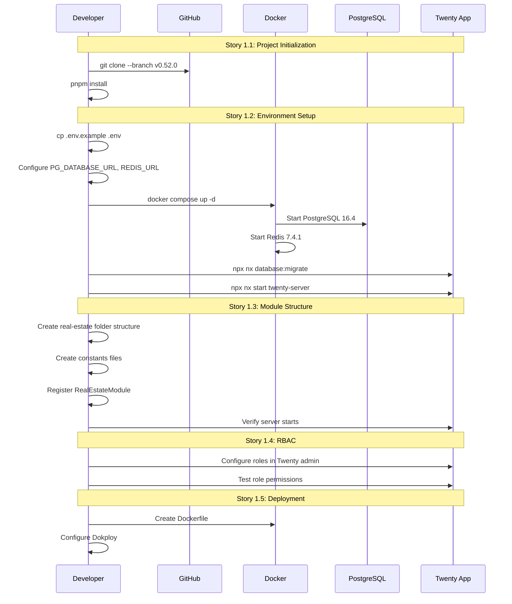

# Epic Technical Specification: Nền tảng & Khởi tạo hệ thống

**Date**: 09/12/2025
**Author**: Luis (Winston - Architect)
**Epic ID**: epic-1
**Status**: Approved

---

## Overview

Epic 1 thiết lập nền tảng kỹ thuật cho Real Estate Sales Distribution Platform bằng cách clone và configure Twenty CRM v0.52.0, tạo cấu trúc module real-estate, thiết lập RBAC, và chuẩn bị CI/CD pipeline. Đây là epic blocking - tất cả epic khác phụ thuộc vào foundation này.

Epic này thực hiện **Phase 0: Technical Validation** từ PRD v1.3 (3 ngày) để validate khả năng mở rộng của Twenty CRM trước khi đầu tư vào các tính năng phức tạp hơn.

---

## Objectives and Scope

### In-Scope ✅

| Item | Description | Story |
|------|-------------|-------|
| Clone Twenty CRM | Clone v0.52.0 từ GitHub | Story 1.1 |
| Environment Setup | PostgreSQL 16.4, Redis 7.4.1, Docker | Story 1.2 |
| Module Structure | Tạo `real-estate.module.ts` và folder structure | Story 1.3 |
| Constants | Định nghĩa Object IDs và Field IDs | Story 1.3 |
| RBAC Configuration | 4 roles: Admin, Sales, Finance, Manager | Story 1.4 |
| Deployment Pipeline | Docker build + Dokploy config | Story 1.5 |

### Out-of-Scope ❌

| Item | Reason | Target Epic |
|------|--------|-------------|
| Custom entities (Project, Property) | Thuộc Epic 2 | Epic 2 |
| Business logic (Reservation, Commission) | Thuộc Epic 2, 5 | Epic 2, 5 |
| Frontend components | Thuộc Epic 4 | Epic 4 |
| Background jobs | Thuộc Epic 2, 6 | Epic 2, 6 |
| Production deployment | Sau khi MVP complete | Epic 7 |

---

## System Architecture Alignment

### Components Referenced

| Architecture Section | Lines | Usage in Epic 1 |
|---------------------|-------|-----------------|
| Project Initialization | 28-36 | Story 1.1 git clone command |
| Environment Setup | 38-51 | Story 1.2 docker compose, env vars |
| Project Structure | 92-121 | Story 1.3 folder structure |
| Security Architecture | 646-666 | Story 1.4 RBAC |
| Deployment Architecture | 697-726 | Story 1.5 Dokploy |

### Constraints from Architecture

1. **Extend, Don't Fork**: Thêm module vào Twenty, không fork repository
2. **Decorator Pattern**: Sử dụng `@WorkspaceEntity` decorators
3. **NestJS Module Pattern**: Follow Twenty's module registration
4. **Docker-based Deployment**: All services containerized

---

## Detailed Design

### Services and Modules

#### Module: `real-estate.module.ts`

```typescript
// packages/twenty-server/src/modules/real-estate/real-estate.module.ts
import { Module } from '@nestjs/common';

@Module({
  imports: [
    // TypeORM imports (added in Epic 2)
    // BullMQ imports (added in Epic 2, 6)
  ],
  providers: [
    // Services (added in Epic 2+)
  ],
  exports: [],
})
export class RealEstateModule {}
```

**Registration in app.module.ts**:
```typescript
import { RealEstateModule } from './modules/real-estate/real-estate.module';

@Module({
  imports: [
    // ... existing Twenty modules
    RealEstateModule, // Add this line
  ],
})
export class AppModule {}
```

### Folder Structure (Story 1.3)

```
packages/twenty-server/src/modules/real-estate/
├── standard-objects/           # Entity definitions (Epic 2+)
│   └── .gitkeep
├── services/                   # Business logic (Epic 2+)
│   └── .gitkeep
├── jobs/                       # Background processors (Epic 2, 6)
│   └── .gitkeep
├── resolvers/                  # Custom GraphQL resolvers (Epic 2+)
│   └── .gitkeep
├── subscribers/                # TypeORM event subscribers (Epic 3)
│   └── .gitkeep
├── constants/
│   ├── real-estate-object-ids.ts
│   └── real-estate-field-ids.ts
└── real-estate.module.ts
```

### Data Models and Contracts

#### Constants: Object IDs

```typescript
// constants/real-estate-object-ids.ts
export const REAL_ESTATE_OBJECT_IDS = {
  project: '20000000-0000-0000-0000-000000000001',
  property: '20000000-0000-0000-0000-000000000002',
  commission: '20000000-0000-0000-0000-000000000003',
  deal: '20000000-0000-0000-0000-000000000004',
  // Note: Contact and Lead extend Twenty's existing objects
} as const;

export type RealEstateObjectId = typeof REAL_ESTATE_OBJECT_IDS[keyof typeof REAL_ESTATE_OBJECT_IDS];
```

#### Constants: Field IDs

```typescript
// constants/real-estate-field-ids.ts
export const PROJECT_FIELD_IDS = {
  name: '21000000-0000-0000-0000-000000000001',
  developer: '21000000-0000-0000-0000-000000000002',
  location: '21000000-0000-0000-0000-000000000003',
  area: '21000000-0000-0000-0000-000000000004',
  totalPlots: '21000000-0000-0000-0000-000000000005',
  availablePlots: '21000000-0000-0000-0000-000000000006',
  status: '21000000-0000-0000-0000-000000000007',
  // ... more fields from PRD 4.1.2
} as const;

export const PROPERTY_FIELD_IDS = {
  plotNumber: '22000000-0000-0000-0000-000000000001',
  blockZone: '22000000-0000-0000-0000-000000000002',
  area: '22000000-0000-0000-0000-000000000003',
  price: '22000000-0000-0000-0000-000000000004',
  status: '22000000-0000-0000-0000-000000000005',
  reservedById: '22000000-0000-0000-0000-000000000006',
  reservedUntil: '22000000-0000-0000-0000-000000000007',
  // ... more fields from PRD 4.2.2
} as const;

// Similar for COMMISSION_FIELD_IDS, DEAL_FIELD_IDS
```

### APIs and Interfaces

**Epic 1 tập trung vào foundation - không có custom APIs**

Twenty CRM auto-generates CRUD APIs từ metadata. Custom mutations (reserveProperty, approveCommission) sẽ được thêm ở Epic 2+.

### Workflows and Sequencing

#### Story Execution Sequence



---

## Non-Functional Requirements

### Performance

| Requirement | Target | Source | Verification |
|-------------|--------|--------|--------------|
| Server startup | <30s | Best practice | Time `npx nx start` |
| Docker build | <5min | Best practice | Time `docker build` |
| Migration run | <60s | Best practice | Time `database:migrate` |

### Security

| Requirement | Implementation | Source |
|-------------|----------------|--------|
| JWT Authentication | Twenty built-in | Architecture lines 648-651 |
| Token Expiry | 7 days | Architecture line 650 |
| RBAC | 4 roles configured | PRD Section 3.x |
| Secrets in .env | Not committed to Git | .gitignore |

**RBAC Matrix** (Story 1.4):

| Module | Admin | Sales Agent | Finance | Manager |
|--------|-------|-------------|---------|---------|
| All Modules | Full | - | - | Read |
| Projects | Full | Read | - | Read |
| Properties | Full | Read + Reserve | - | Read |
| Commissions | Full | View Own | Full | Read |
| Leads | Full | Own Only | - | Read |
| Reports | Full | Own | Export | Full |

### Reliability/Availability

| Requirement | Target | Implementation |
|-------------|--------|----------------|
| Dev environment uptime | 99% during work hours | Docker restart policies |
| Database persistence | Survive container restart | Docker volumes |
| Redis persistence | Survive container restart | Docker volumes |

### Observability

| Requirement | Implementation | Story |
|-------------|----------------|-------|
| Console logging | Twenty's built-in logger | Default |
| Structured JSON logs | Winston logger | Default |
| Health check endpoint | /health | Default in Twenty |

**[ASSUMPTION: Production monitoring (Sentry, etc.) will be added in Epic 7]**

---

## Dependencies and Integrations

### Runtime Dependencies

| Package | Version | Purpose | Source |
|---------|---------|---------|--------|
| Node.js | 20.18.0 LTS | JavaScript runtime | Architecture |
| pnpm | 9.14.2 | Package manager | Architecture |
| PostgreSQL | 16.4 | Database | Architecture |
| Redis | 7.4.1 | Cache + Queue | Architecture |
| Docker | 27.3.1 | Containerization | Architecture |

### Twenty CRM Dependencies (Inherited)

| Package | Version | Purpose |
|---------|---------|---------|
| @nestjs/core | 10.4.7 | Backend framework |
| typeorm | 0.3.20 | ORM |
| @apollo/server | 4.11.0 | GraphQL |
| bullmq | 5.13.0 | Background jobs |
| react | 18.3.1 | Frontend |
| recoil | 0.7.7 | State management |

### External Services

| Service | Purpose | Required in Epic 1? |
|---------|---------|---------------------|
| GitHub | Source code | ✅ Yes |
| Docker Hub | Base images | ✅ Yes |
| Dokploy | Deployment | Story 1.5 only |

---

## Acceptance Criteria (Authoritative)

### Story 1.1: Project Initialization

| AC ID | Acceptance Criteria | Test Method |
|-------|---------------------|-------------|
| AC-1.1.1 | Given fresh environment, When run `git clone --branch v0.52.0`, Then Twenty v0.52.0 cloned | `git describe --tags` shows v0.52.0 |
| AC-1.1.2 | Given cloned repo, When run `pnpm install`, Then all dependencies installed without errors | Exit code 0, no error logs |
| AC-1.1.3 | Given dependencies installed, When check node version, Then Node.js 20.18.0 LTS confirmed | `node -v` output matches |

### Story 1.2: Development Environment Setup

| AC ID | Acceptance Criteria | Test Method |
|-------|---------------------|-------------|
| AC-1.2.1 | Given .env configured, When run `docker compose up -d`, Then PostgreSQL 16.4 and Redis 7.4.1 start | `docker ps` shows containers running |
| AC-1.2.2 | Given infrastructure running, When run `database:migrate`, Then schema created | No migration errors |
| AC-1.2.3 | Given all services running, When access localhost:3000, Then API responds | `curl localhost:3000/health` returns 200 |
| AC-1.2.4 | Given all services running, When access localhost:3001, Then frontend loads | Browser shows Twenty UI |

### Story 1.3: Real Estate Module Structure

| AC ID | Acceptance Criteria | Test Method |
|-------|---------------------|-------------|
| AC-1.3.1 | Given module created, When imported in app.module.ts, Then no compilation errors | `npx nx build twenty-server` succeeds |
| AC-1.3.2 | Given constants defined, Then REAL_ESTATE_OBJECT_IDS contains unique UUIDs | Unit test validates uniqueness |
| AC-1.3.3 | Given module registered, When server starts, Then no runtime errors | Server logs show no errors |
| AC-1.3.4 | Given module structure, Then folder matches architecture source tree | Manual verification |

### Story 1.4: RBAC Configuration

| AC ID | Acceptance Criteria | Test Method |
|-------|---------------------|-------------|
| AC-1.4.1 | Given Admin role, When login, Then full access granted | Admin can access all modules |
| AC-1.4.2 | Given Sales role, When access Commission, Then view-only | Sales cannot edit commissions |
| AC-1.4.3 | Given Finance role, When access Property, Then denied | Finance gets 403 on property endpoints |
| AC-1.4.4 | Given JWT token, When expired after 7 days, Then re-auth required | Token validation fails after 7 days |

### Story 1.5: Deployment Pipeline

| AC ID | Acceptance Criteria | Test Method |
|-------|---------------------|-------------|
| AC-1.5.1 | Given Dockerfile, When built, Then image < 500MB | `docker images` shows size |
| AC-1.5.2 | Given Dokploy config, When deployed, Then app accessible | HTTPS endpoint responds |
| AC-1.5.3 | Given secrets, When deployed, Then not in logs | Container logs don't contain passwords |
| AC-1.5.4 | Given Nginx, When HTTPS, Then SSL works | Browser shows valid certificate |

---

## Traceability Mapping

| AC ID | Spec Section | Architecture Ref | Component | Test Type |
|-------|--------------|------------------|-----------|-----------|
| AC-1.1.1 | Project Initialization | Lines 28-36 | Git clone | Manual |
| AC-1.1.2 | Project Initialization | Lines 43 | pnpm install | Manual |
| AC-1.1.3 | Prerequisites | Lines 26 | Node.js | Manual |
| AC-1.2.1 | Environment Setup | Lines 38-43 | Docker Compose | Manual |
| AC-1.2.2 | Environment Setup | Lines 46 | Database migration | Manual |
| AC-1.2.3 | Environment Setup | Lines 48-50 | Twenty Server | Integration |
| AC-1.2.4 | Environment Setup | Lines 48-50 | Twenty Frontend | Integration |
| AC-1.3.1 | Module Structure | Lines 92-121 | real-estate.module.ts | Compilation |
| AC-1.3.2 | Constants | Lines 117-119 | Object IDs | Unit test |
| AC-1.3.3 | Module Structure | Lines 92-121 | Module registration | Integration |
| AC-1.3.4 | Project Structure | Lines 92-121 | Folder structure | Manual |
| AC-1.4.1 | RBAC | Lines 653-660 | Admin role | Integration |
| AC-1.4.2 | RBAC | Lines 653-660 | Sales role | Integration |
| AC-1.4.3 | RBAC | Lines 653-660 | Finance role | Integration |
| AC-1.4.4 | Security | Lines 648-651 | JWT | Integration |
| AC-1.5.1 | Deployment | Lines 697-726 | Dockerfile | Manual |
| AC-1.5.2 | Deployment | Lines 697-726 | Dokploy | Integration |
| AC-1.5.3 | Security | Lines 730-752 | Secrets | Manual |
| AC-1.5.4 | Deployment | Lines 718-720 | Nginx SSL | Integration |

---

## Risks, Assumptions, Open Questions

### Risks

| ID | Risk | Impact | Likelihood | Mitigation |
|----|------|--------|------------|------------|
| R1 | Twenty v0.52.0 not compatible with our extensions | High | Low | Test early in Story 1.3 |
| R2 | RBAC customization limited in Twenty | Medium | Medium | Research Twenty's permission system first |
| R3 | Docker build fails on M1 Mac | Low | Low | Use --platform linux/amd64 |

### Assumptions

| ID | Assumption | Validation |
|----|------------|------------|
| A1 | Twenty CRM v0.52.0 is stable | Check GitHub issues before clone |
| A2 | NestJS module pattern works for custom objects | Verified in Twenty's existing modules |
| A3 | UUIDs for object IDs don't conflict with Twenty's | Use 20000000+ prefix range |
| A4 | Dokploy supports our Docker setup | Test in Story 1.5 |

### Open Questions

| ID | Question | Owner | Due |
|----|----------|-------|-----|
| Q1 | Do we need to modify Twenty's permission system or use a custom layer? | Dev Team | Story 1.4 |
| Q2 | What's the exact Dokploy configuration for multi-container apps? | DevOps | Story 1.5 |

---

## Test Strategy Summary

### Test Levels

| Level | Scope | Tools | Coverage |
|-------|-------|-------|----------|
| Manual | All ACs | Developer verification | 100% ACs |
| Unit | Constants, utilities | Jest (Twenty's built-in) | Object IDs, Field IDs |
| Integration | Module registration, API health | Jest + Supertest | Server startup, endpoints |
| Smoke | End-to-end setup | Manual checklist | Full flow verification |

### Test Execution Order

1. **Story 1.1**: Manual verification of clone and install
2. **Story 1.2**: Manual + smoke test (docker, migrate, server start)
3. **Story 1.3**: Unit tests for constants + compilation check
4. **Story 1.4**: Integration tests for RBAC (or manual with test users)
5. **Story 1.5**: Manual deployment verification

### Definition of Done

- [ ] All ACs verified ✅
- [ ] No TypeScript compilation errors
- [ ] Server starts without runtime errors
- [ ] RBAC roles tested
- [ ] Dokploy deployment works (staging)
- [ ] Documentation updated

---

## Appendix: Setup Commands Quick Reference

```bash
# Story 1.1: Clone
git clone --branch v0.52.0 https://github.com/twentyhq/twenty.git
cd twenty
pnpm install

# Story 1.2: Environment
cp packages/twenty-server/.env.example packages/twenty-server/.env
# Edit .env with PG_DATABASE_URL and REDIS_URL
docker compose -f docker-compose.dev.yml up -d
npx nx database:migrate twenty-server
npx nx start twenty-server
npx nx start twenty-front

# Story 1.3: Module (manual file creation)
mkdir -p packages/twenty-server/src/modules/real-estate/{standard-objects,services,jobs,resolvers,subscribers,constants}

# Story 1.4: RBAC (via Twenty admin UI)

# Story 1.5: Build
docker build -t twenty-real-estate:latest .
```

---

_Generated by Winston (BMAD Architect) for Luis_
_Date: 09/12/2025_
_Epic: 1 - Nền tảng & Khởi tạo hệ thống_
