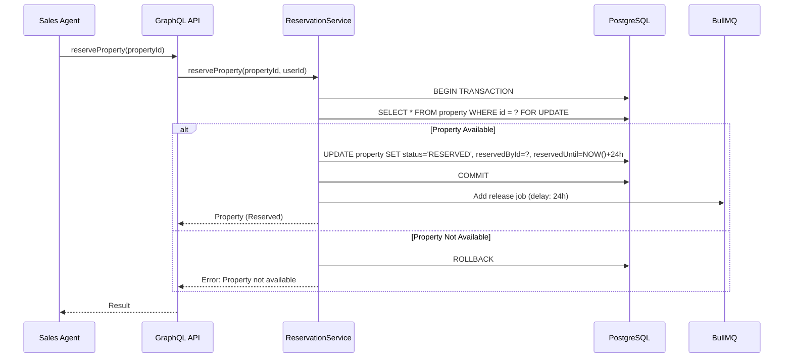

# Epic Technical Specification: Quản lý Tồn kho Bất động sản

**Date**: 09/12/2025
**Author**: Luis (Winston - Architect)
**Epic ID**: epic-2
**Status**: Approved
**Dependencies**: Epic 1 (Foundation)

---

## Overview

Epic 2 xây dựng module quản lý tồn kho bất động sản với 2 custom entities chính: **Project** và **Property**. Đây là core module của platform với business logic phức tạp nhất: reservation system với auto-release sau 24h và double-booking prevention sử dụng pessimistic locking.

Epic này implement các sections 4.1 (Projects) và 4.2 (Properties) từ PRD v1.3.

---

## Objectives and Scope

### In-Scope ✅

| Item | Description | PRD Section |
|------|-------------|-------------|
| Project Entity | CRUD + relations | 4.1 |
| Property Entity | CRUD + status workflow | 4.2 |
| Reservation System | Reserve property for 24h | 4.2.3 |
| Auto-Release Job | Background job release expired reservations | 4.2.3 |
| Double-Booking Prevention | Pessimistic locking | 4.2.3 |
| Dashboard Widget | Available plots per project | 4.1.3 |
| File Gallery | Master plan + property images | 4.1.2, 4.2.2 |

### Out-of-Scope ❌

| Item | Reason | Target Epic |
|------|--------|-------------|
| Deal creation on deposit | Thuộc Epic 3 | Epic 3 |
| Commission auto-creation | Thuộc Epic 5 | Epic 5 |
| Interactive plot map | Thuộc Epic 7 | Epic 7 |
| Google Maps integration | Phase 2 | Epic 7 |

---

## System Architecture Alignment

### Components to Implement

| Component | Architecture Lines | Purpose |
|-----------|-------------------|---------|
| `project.workspace-entity.ts` | 94, 268-285 | Project entity definition |
| `property.workspace-entity.ts` | 95, 286-330 | Property entity definition |
| `property.service.ts` | 103 | Property business logic |
| `reservation.service.ts` | 104, 285-330 | Reservation with locking |
| `reservation-release.job.ts` | 110, 403-448 | Background job |
| `property.resolver.ts` | 114 | Custom mutations |

### Implementation Patterns

| Pattern | Architecture Lines | Usage |
|---------|-------------------|-------|
| @WorkspaceEntity | 268-285 | Entity definitions |
| Pessimistic Locking | 285-330 | Reservation |
| BullMQ Processor | 403-448 | Auto-release job |
| Cron Job | 435 | Periodic check |

---

## Detailed Design

### Services and Modules

#### Module Update: `real-estate.module.ts`

```typescript
@Module({
  imports: [
    TypeOrmModule.forFeature([
      ProjectWorkspaceEntity,
      PropertyWorkspaceEntity,
    ]),
    BullModule.registerQueue({ name: 'real-estate' }),
  ],
  providers: [
    ProjectService,
    PropertyService,
    ReservationService,
    ReservationReleaseJob,
    PropertyResolver,
  ],
  exports: [ProjectService, PropertyService, ReservationService],
})
export class RealEstateModule {}
```

### Data Models and Contracts

#### Entity: Project

```typescript
// standard-objects/project.workspace-entity.ts
@WorkspaceEntity({
  standardId: REAL_ESTATE_OBJECT_IDS.project,
  namePlural: 'projects',
  labelSingular: 'Project',
  labelPlural: 'Projects',
  description: 'Real estate project',
  icon: 'IconBuilding',
})
export class ProjectWorkspaceEntity extends BaseWorkspaceEntity {
  @WorkspaceField({
    standardId: PROJECT_FIELD_IDS.name,
    type: FieldMetadataType.TEXT,
    label: 'Name',
    isNullable: false,
  })
  name: string;

  @WorkspaceField({
    standardId: PROJECT_FIELD_IDS.developer,
    type: FieldMetadataType.TEXT,
    label: 'Developer',
  })
  developer: string;

  @WorkspaceField({
    standardId: PROJECT_FIELD_IDS.location,
    type: FieldMetadataType.TEXT,
    label: 'Location',
  })
  location: string;

  @WorkspaceField({
    standardId: PROJECT_FIELD_IDS.status,
    type: FieldMetadataType.SELECT,
    label: 'Status',
    options: [
      { value: 'PLANNING', label: 'Planning', color: 'gray' },
      { value: 'ACTIVE', label: 'Active', color: 'green' },
      { value: 'SOLD_OUT', label: 'Sold Out', color: 'blue' },
      { value: 'SUSPENDED', label: 'Suspended', color: 'red' },
    ],
  })
  status: string;

  @WorkspaceField({
    standardId: PROJECT_FIELD_IDS.totalPlots,
    type: FieldMetadataType.NUMBER,
    label: 'Total Plots',
  })
  totalPlots: number;

  @WorkspaceField({
    standardId: PROJECT_FIELD_IDS.availablePlots,
    type: FieldMetadataType.NUMBER,
    label: 'Available Plots',
    description: 'Computed field',
  })
  availablePlots: number;

  @WorkspaceField({
    standardId: PROJECT_FIELD_IDS.commissionRate,
    type: FieldMetadataType.NUMBER,
    label: 'Commission Rate (%)',
  })
  commissionRate: number;

  @WorkspaceField({
    standardId: PROJECT_FIELD_IDS.priceMin,
    type: FieldMetadataType.CURRENCY,
    label: 'Min Price',
  })
  priceMin: number;

  @WorkspaceField({
    standardId: PROJECT_FIELD_IDS.priceMax,
    type: FieldMetadataType.CURRENCY,
    label: 'Max Price',
  })
  priceMax: number;

  @WorkspaceField({
    standardId: PROJECT_FIELD_IDS.masterPlanImage,
    type: FieldMetadataType.FILE,
    label: 'Master Plan',
  })
  masterPlanImage: string;

  @WorkspaceRelation({
    standardId: PROJECT_FIELD_IDS.properties,
    type: RelationType.ONE_TO_MANY,
    label: 'Properties',
    inverseSideTarget: () => PropertyWorkspaceEntity,
  })
  properties: Relation<PropertyWorkspaceEntity[]>;
}
```

#### Entity: Property

```typescript
// standard-objects/property.workspace-entity.ts
@WorkspaceEntity({
  standardId: REAL_ESTATE_OBJECT_IDS.property,
  namePlural: 'properties',
  labelSingular: 'Property',
  labelPlural: 'Properties',
  description: 'Land plot in a project',
  icon: 'IconHome',
})
export class PropertyWorkspaceEntity extends BaseWorkspaceEntity {
  @WorkspaceField({
    standardId: PROPERTY_FIELD_IDS.plotNumber,
    type: FieldMetadataType.TEXT,
    label: 'Plot Number',
    isNullable: false,
  })
  plotNumber: string;

  @WorkspaceField({
    standardId: PROPERTY_FIELD_IDS.blockZone,
    type: FieldMetadataType.TEXT,
    label: 'Block/Zone',
  })
  blockZone: string;

  @WorkspaceField({
    standardId: PROPERTY_FIELD_IDS.area,
    type: FieldMetadataType.NUMBER,
    label: 'Area (m²)',
  })
  area: number;

  @WorkspaceField({
    standardId: PROPERTY_FIELD_IDS.price,
    type: FieldMetadataType.CURRENCY,
    label: 'Price (VNĐ)',
  })
  price: number;

  @WorkspaceField({
    standardId: PROPERTY_FIELD_IDS.status,
    type: FieldMetadataType.SELECT,
    label: 'Status',
    options: [
      { value: 'AVAILABLE', label: 'Available', color: 'green' },
      { value: 'RESERVED', label: 'Reserved', color: 'yellow' },
      { value: 'DEPOSIT_PAID', label: 'Deposit Paid', color: 'orange' },
      { value: 'CONTRACTED', label: 'Contracted', color: 'blue' },
      { value: 'SOLD', label: 'Sold', color: 'purple' },
    ],
  })
  status: string;

  @WorkspaceField({
    standardId: PROPERTY_FIELD_IDS.reservedById,
    type: FieldMetadataType.RELATION,
    label: 'Reserved By',
  })
  reservedById: string;

  @WorkspaceField({
    standardId: PROPERTY_FIELD_IDS.reservedUntil,
    type: FieldMetadataType.DATE_TIME,
    label: 'Reserved Until',
  })
  reservedUntil: Date;

  @WorkspaceRelation({
    standardId: PROPERTY_FIELD_IDS.project,
    type: RelationType.MANY_TO_ONE,
    label: 'Project',
    inverseSideTarget: () => ProjectWorkspaceEntity,
  })
  project: Relation<ProjectWorkspaceEntity>;
}
```

### APIs and Interfaces

#### Custom Mutations

```graphql
type Mutation {
  # Reserve a property for 24 hours
  reserveProperty(propertyId: ID!): Property!

  # Release a reservation (manual or auto)
  releaseProperty(propertyId: ID!): Property!
}

type Query {
  # Get available properties by project
  availableProperties(projectId: ID!): [Property!]!

  # Get my reserved properties
  myReservedProperties: [Property!]!
}
```

#### Resolver Implementation

```typescript
// resolvers/property.resolver.ts
@Resolver(() => Property)
export class PropertyResolver {
  constructor(private reservationService: ReservationService) {}

  @Mutation(() => Property)
  async reserveProperty(
    @Args('propertyId') propertyId: string,
    @CurrentUser() user: User,
  ): Promise<Property> {
    return this.reservationService.reserveProperty(propertyId, user.id);
  }

  @Mutation(() => Property)
  async releaseProperty(
    @Args('propertyId') propertyId: string,
    @CurrentUser() user: User,
  ): Promise<Property> {
    return this.reservationService.releaseProperty(propertyId, user.id);
  }
}
```

### Workflows and Sequencing

#### Property Status Flow

```
AVAILABLE → RESERVED → DEPOSIT_PAID → CONTRACTED → SOLD
                ↓
           (24h timeout)
                ↓
           AVAILABLE
```

#### Reservation Sequence



---

## Non-Functional Requirements

### Performance

| Requirement | Target | Implementation |
|-------------|--------|----------------|
| Reserve property | <500ms | Pessimistic lock, single transaction |
| List properties | <200ms | Redis caching (5 min TTL) |
| Available plots count | <100ms | Cached computation |

### Security

| Requirement | Implementation |
|-------------|----------------|
| Only Sales can reserve | RBAC check in resolver |
| Only owner can release | Check reservedById |
| Admin can force release | Override check for Admin role |

### Reliability

| Requirement | Implementation |
|-------------|----------------|
| No double-booking | Pessimistic locking |
| No orphan reservations | Cron job every 5 min |
| Transaction isolation | READ COMMITTED |

---

## Dependencies and Integrations

### Internal Dependencies

| Component | Purpose |
|-----------|---------|
| Epic 1 | Module structure, constants |
| Twenty metadata | Entity registration |
| BullMQ | Background job processing |

### Database Schema

```sql
-- Generated by Twenty metadata system
CREATE TABLE property (
  id UUID PRIMARY KEY,
  plot_number VARCHAR NOT NULL,
  block_zone VARCHAR,
  area NUMERIC,
  price NUMERIC,
  status VARCHAR DEFAULT 'AVAILABLE',
  reserved_by_id UUID REFERENCES user(id),
  reserved_until TIMESTAMPTZ,
  project_id UUID REFERENCES project(id),
  created_at TIMESTAMPTZ DEFAULT NOW(),
  updated_at TIMESTAMPTZ DEFAULT NOW()
);

CREATE INDEX idx_property_status ON property(status);
CREATE INDEX idx_property_project ON property(project_id);
CREATE INDEX idx_property_reserved_until ON property(reserved_until) WHERE status = 'RESERVED';
```

---

## Acceptance Criteria

### Story 2.1: Project Entity CRUD

| AC ID | Criteria | Test |
|-------|----------|------|
| AC-2.1.1 | Admin can create project with all fields | GraphQL mutation |
| AC-2.1.2 | Project appears in list view | Query projects |
| AC-2.1.3 | Master plan image uploads successfully | File upload |
| AC-2.1.4 | availablePlots updates when properties change | Computed field |

### Story 2.2: Property Entity CRUD

| AC ID | Criteria | Test |
|-------|----------|------|
| AC-2.2.1 | Admin can create property under project | GraphQL mutation |
| AC-2.2.2 | Property shows in project detail | Relation query |
| AC-2.2.3 | Status changes reflect correctly | Update mutation |

### Story 2.3: Reservation System

| AC ID | Criteria | Test |
|-------|----------|------|
| AC-2.3.1 | Sales can reserve AVAILABLE property | reserveProperty mutation |
| AC-2.3.2 | Reserved property shows reservedUntil = NOW + 24h | Check datetime |
| AC-2.3.3 | Cannot reserve already RESERVED property | Error handling |
| AC-2.3.4 | reservedById set to current user | Check field |

### Story 2.4: Auto-Release Job

| AC ID | Criteria | Test |
|-------|----------|------|
| AC-2.4.1 | Job runs every 5 minutes | Cron schedule |
| AC-2.4.2 | Expired reservations released | Status = AVAILABLE |
| AC-2.4.3 | Non-expired reservations untouched | Status unchanged |
| AC-2.4.4 | Job is idempotent | Run multiple times |

### Story 2.5: Double-Booking Prevention

| AC ID | Criteria | Test |
|-------|----------|------|
| AC-2.5.1 | Concurrent requests - only one succeeds | Load test |
| AC-2.5.2 | Pessimistic lock acquired | Transaction log |
| AC-2.5.3 | Loser gets clear error message | Error response |

### Story 2.6: Dashboard Widgets

| AC ID | Criteria | Test |
|-------|----------|------|
| AC-2.6.1 | Shows total plots per project | Widget renders |
| AC-2.6.2 | Shows available plots count | Matches DB |
| AC-2.6.3 | Updates on property status change | Real-time update |

### Story 2.7: File Gallery

| AC ID | Criteria | Test |
|-------|----------|------|
| AC-2.7.1 | Upload master plan image (<20MB) | File upload |
| AC-2.7.2 | Upload property images (<10MB each) | File upload |
| AC-2.7.3 | View gallery in project detail | UI renders |

---

## Traceability Mapping

| AC ID | PRD Section | Architecture Lines | Component |
|-------|-------------|-------------------|-----------|
| AC-2.1.x | 4.1.2 | 268-285 | ProjectWorkspaceEntity |
| AC-2.2.x | 4.2.2 | 286-330 | PropertyWorkspaceEntity |
| AC-2.3.x | 4.2.3 | 285-330 | ReservationService |
| AC-2.4.x | 4.2.3 | 403-448 | ReservationReleaseJob |
| AC-2.5.x | 4.2.3 | 285-330 | Pessimistic locking |
| AC-2.6.x | 4.1.3 | N/A | Dashboard widget |
| AC-2.7.x | 4.1.2, 4.2.2 | 745-752 | File storage |

---

## Risks and Assumptions

### Risks

| ID | Risk | Mitigation |
|----|------|------------|
| R1 | Twenty's metadata doesn't support complex relations | Test early with POC |
| R2 | Pessimistic locking causes deadlocks | Use timeout, SKIP LOCKED |
| R3 | BullMQ job fails silently | Add monitoring, retry logic |

### Assumptions

| ID | Assumption |
|----|------------|
| A1 | Twenty's @WorkspaceEntity supports custom SELECT options |
| A2 | Twenty's file upload works for master plan images |
| A3 | Redis is running for BullMQ queue |

---

## Test Strategy

| Level | Scope | Tools |
|-------|-------|-------|
| Unit | Entity validation, service logic | Jest |
| Integration | Reservation flow, job execution | Jest + DB |
| Load | Concurrent reservations | k6 or artillery |
| E2E | Full flow via UI | Playwright |

---

_Epic 2: Quản lý Tồn kho Bất động sản - 7 stories_
